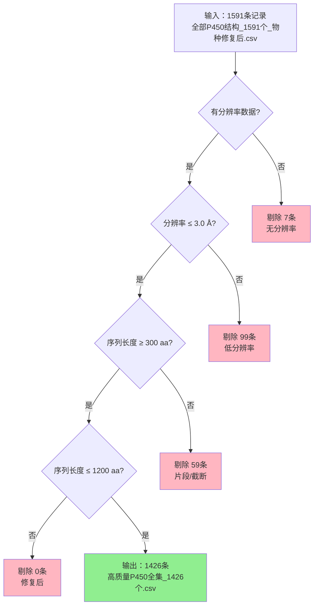

# P450数据集质量筛选流程说明（1591 → 1426）

**文档版本**: v1.0
**创建日期**: 2026-02-02
**作者**: Claude Code

---

## 一、数据来源

### 输入数据（1591条）
**文件路径**:
`任务2_RCSB全局搜索\数据文件\修复后数据\全部P450结构_1591个_物种修复后.csv`

**数据粒度**:
- 以 **PDB条目 + 蛋白实体** 为单位（字段：`pdb_id` + `entity_id`）
- 一个PDB结构可能包含多个蛋白实体，每个实体作为一条独立记录
- **非唯一蛋白**：相同UniProt ID的蛋白可能在不同PDB中重复出现

**关键字段**:
| 字段名 | 说明 |
|--------|------|
| `pdb_id` | PDB结构编号（如：1A1A） |
| `entity_id` | 蛋白实体编号（通常为1） |
| `resolution` | X-ray/Cryo-EM分辨率（Å） |
| `sequence_length` | 蛋白序列长度（aa） |
| `ligands` | 结合的所有小分子（配体/辅因子/溶剂） |
| `uniprot_ids` | 对应的UniProt ID列表 |
| `species_category` | 物种分类（bacteria/mammals/fungi/plants/other） |

---

## 二、筛选流程（1591 → 1426）

### 执行脚本
`脚本/数据质量修复脚本.py` (v4)

### 筛选参数
```python
MAX_RESOLUTION = 3.0      # 最大分辨率（Å）
MIN_SEQ_LENGTH = 300      # 最小序列长度（aa）
MAX_SEQ_LENGTH = 1200     # 最大序列长度（aa）- 修复后扩展
```

### 筛选步骤（按顺序执行）

**重要说明**: 以下是**顺序筛选**（early-exit），每条记录遇到第一个不满足的条件即被剔除，不再进入后续判断。

```
输入：1591条记录
   ↓
【步骤1】分辨率存在性检查
   - 条件：必须有resolution数值
   - 剔除：7条（无分辨率数据，如某些NMR结构或元数据缺失）
   - 剩余：1584条
   ↓
【步骤2】分辨率质量检查
   - 条件：resolution ≤ 3.0 Å
   - 剔除：99条（低分辨率结构）
   - 剩余：1485条
   ↓
【步骤3】序列长度下限检查
   - 条件：sequence_length ≥ 300 aa
   - 剔除：59条（片段/截断结构）
   - 剩余：1426条
   ↓
【步骤4】序列长度上限检查（修复后）
   - 条件：sequence_length ≤ 1200 aa
   - 剔除：0条（修复前会剔除5条）
   - 最终：1426条 ✓
```

### 筛选结果汇总

| 筛选条件 | 剔除数量 | 剩余数量 |
|---------|---------|---------|
| 输入总数 | - | 1591 |
| 无分辨率数据 | 7 | 1584 |
| 分辨率 > 3.0 Å | 99 | 1485 |
| 序列长度 < 300 aa | 59 | 1426 |
| 序列长度 > 1200 aa | 0 | **1426** |
| **总计剔除** | **165** | - |

---

## 三、科学依据：为什么设置这些阈值？

### 3.1 分辨率 ≤ 3.0 Å

**原因**:
1. **结构可靠性**: P450活性位点的侧链构象、配体结合模式、Fe-配体距离等关键信息需要较高分辨率
2. **特征质量**: 下游提取的口袋特征、对接复合物、图网络需要准确的原子坐标
3. **可比性**: >3.0 Å的结构在侧链、环区存在较大不确定性

**典型P450结构分辨率**:
- 高质量: 1.5-2.5 Å
- 可用: 2.5-3.0 Å
- 低质量: >3.0 Å

### 3.2 序列长度 300-1200 aa

**下限（≥300 aa）**:
- 典型P450催化结构域: ~400-550 aa
- <300 aa通常是：
  - 截断片段
  - 非完整结构域
  - 工程化构建
- 排除片段保证"序列-结构-功能"完整性

**上限（≤1200 aa）**:
- 允许保留多结构域P450（如P450 BM3融合蛋白）
- 原始上限600 aa过于严格，会排除重要的长序列P450

---

## 四、修复前后对比：找回的5条重要结构

### 原始筛选（有误）
- **序列上限**: 600 aa
- **输出**: 1421条
- **文件**: `原始筛选结果_有误/高质量P450全集_1421个.csv`

### 修复后筛选
- **序列上限**: 1200 aa
- **输出**: 1426条
- **文件**: `修复后最终版/高质量P450全集_1426个.csv`

### 找回的5条记录

| PDB | Entity | UniProt | 物种 | 序列长度 | 分辨率 | 说明 |
|-----|--------|---------|------|---------|--------|------|
| 7M8I | 1 | P10109, P19099 | Homo sapiens | 609 aa | 2.94 Å | 人源长序列构建体 |
| 6KBH | 1 | C7SFP5 | Rhodococcus sp. | 786 aa | 2.60 Å | 细菌长序列P450 |
| 6LAA | 1 | A0A0K6ITW2 | Tepidiphilus | 779 aa | 2.13 Å | 嗜热细菌P450 |
| 6ZZX | 1 | W8SY74 | Chlorella ohadii | 741 aa | 2.70 Å | 藻类P450（实体1） |
| 6ZZX | 2 | W8SUA3 | Chlorella ohadii | 731 aa | 2.70 Å | 藻类P450（实体2） |

**关键发现**:
- 所有5条记录的分辨率均 ≤ 3.0 Å，质量符合要求
- 序列长度在609-786 aa之间，远低于1200 aa上限
- 包含重要的人源P450和特殊物种P450

---

## 五、其他修复（不影响1591→1426的数量）

### 5.1 物种分类修复

**问题**: 旧版本使用taxonomy ID数值范围推断物种界，导致误分类

**典型错误**:
- Trypanosoma（原生生物，taxid 5691/5693）被误判为 `bacteria`
- Danio rerio（斑马鱼，taxid 7955）被误判为 `bacteria`

**修复方案**: 使用静态物种分类表（`TAXONOMY_CATEGORY_MAP`）

**修复结果**:
- 总计修正：138条记录
- 主要修正：26条Trypanosoma记录（bacteria → other）
- 主要修正：4条Danio记录（bacteria → other）

### 5.2 辅因子/溶剂排除列表扩展

**问题**: 下游配体分类时，部分结晶溶剂被误认为底物

**新增排除项**:
```python
# 溶剂类（CRITICAL - 修复前缺失）
"IPA",   # 异丙醇 - 常见结晶添加剂
"EOH", "ETOH",  # 乙醇
"MOH",   # 甲醇
"PEG",   # 聚乙二醇
"PG4", "PGE", "1PE", "P6G", "PG0",  # PEG变体
"MPD",   # 2-甲基-2,4-戊二醇
"GOL",   # 甘油
"EDO",   # 乙二醇
```

**影响**: 防止将结晶溶剂错误计为"底物结合"，提高下游ML数据集质量

---

## 六、输出文件

### 主要输出
```
修复后最终版/
├── 高质量P450全集_1426个.csv          # 通过质量筛选的所有记录
├── ML训练数据集_186个.csv             # 有配体且去重后的ML训练集
├── 按物种分类_1426个/                 # 按物种拆分的1426条全集
│   ├── P450_bacteria_844个.csv
│   ├── P450_fungi_70个.csv
│   ├── P450_mammals_297个.csv
│   ├── P450_other_189个.csv
│   └── P450_plants_26个.csv
└── 按物种分类_186个/                  # 按物种拆分的186条ML集
    ├── ML数据集_bacteria_100个.csv
    ├── ML数据集_fungi_5个.csv
    ├── ML数据集_mammals_33个.csv
    ├── ML数据集_other_41个.csv
    └── ML数据集_plants_7个.csv
```

### 文件说明
| 文件 | 记录数 | 说明 |
|------|--------|------|
| 高质量P450全集_1426个 | 1426 | 通过质量筛选，未去重 |
| ML训练数据集_186个 | 186 | 有配体 + 按UniProt去重 |

---

## 七、筛选流程图



---

## 八、总结

### 核心筛选逻辑
1. **分辨率质量**: ≤ 3.0 Å，保证结构可靠性
2. **序列完整性**: 300-1200 aa，排除片段、保留多结构域

### 关键修复
1. **序列上限**: 600 → 1200 aa，找回5条重要长序列P450
2. **物种分类**: 修正138条误分类记录
3. **溶剂排除**: 扩展辅因子列表，提高配体识别准确性

### 最终产出
- **1426条高质量P450结构**（从1591条筛选）
- **通过率**: 89.6%（1426/1591）
- **剔除率**: 10.4%（165/1591）

---

**相关文件**:
- 筛选脚本：`脚本/数据质量修复脚本.py` (v4)
- 执行日志：`日志/任务3_执行日志_20260104_022716.txt` (原始运行，1421条)
  - **注意**: 该日志为原始运行（序列上限600aa），显示1421条通过
  - 修复后运行（序列上限1200aa）的日志未单独保存，但筛选结果为1426条
- 输出数据：`数据文件/修复后最终版/`
