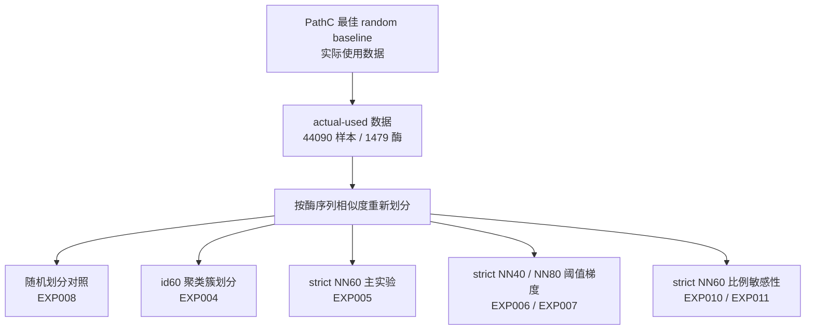

# Q2 序列相似度划分实验汇报版简明总结

日期：2026-05-25  
用途：给老师汇报、做 PPT、自己快速回看。  
详细过程和完整审计见同目录下的 `session_log.md`、`Q2序列相似度划分实验汇总.md`、`Q2_EXP005_EXP010_EXP011_test集差异审计_2026-05-25.md`。

## 1. 这个任务在回答什么

老师提出的问题可以简化成：

> 如果测试集里的酶，和训练集里的酶在序列上不像，模型还能不能表现得很好？

原来的随机划分（random split）会把相似酶分到 train、val、test 里。这样模型可能见过很像的酶，测试分数会偏乐观。Q2 的目标是重新组织 train/val/test，让测试集更能反映“新酶泛化”难度。

这里的 strict NN 指严格最近邻（strict nearest-neighbor）划分。以 strict NN60 为例，它要求 test/val 里的酶到 train 酶没有 `>=60%` 序列相似度的近邻。

整体流程：

## 2. 目前已经完成的正式结果

| 实验 | 数据划分方式 | Test AUC | Test AUPR | test samples | test positives | test 正样本率 | 主要用途 |
|---|---|---:|---:|---:|---:|---:|---|
| EXP008 | PathD 随机划分对照 | 0.934206 | 0.686618 | 10999 | 984 | 8.95% | 证明 PathD 训练管线正常，随机划分仍然很高 |
| EXP004 | id60 聚类簇划分 | 0.807786 | 0.321236 | 11107 | 1006 | 9.06% | 观察按序列聚类隔离后性能下降 |
| EXP007 | strict NN80 | 0.819789 | 0.383128 | 11123 | 1160 | 10.43% | 宽松阈值，对照 NN40/NN60 |
| EXP010 | strict NN60，7:1.5:1.5 | 0.733258 | 0.225581 | 6621 | 632 | 9.55% | strict NN60 下改变比例的补充实验 |
| EXP005 | strict NN60，约 2:1:1 | 0.670801 | 0.218569 | 11091 | 1006 | 9.07% | 回答老师 `<60%` 要求的主实验 |
| EXP011 | strict NN60，8:1:1 | 0.602512 | 0.169727 | 4466 | 435 | 9.74% | strict NN60 下 8:1:1 候选，测试集更小 |
| EXP006 | strict NN40 | 0.638403 | 0.102411 | 11755 | 899 | 7.65% | 更严格远缘泛化设置 |

## 3. 每类实验分别回答什么

| 问题 | 对应实验 | 能说明什么 |
|---|---|---|
| 随机划分是否偏乐观 | EXP008 vs EXP005 | 随机划分 AUC 0.934，strict NN60 降到 0.671 |
| 老师提出的 `<60%` 要求如何回答 | EXP005 | test/val 到 train 无 `>=60%` 近邻，是当前主实验 |
| 阈值越严格，任务是否更难 | EXP007 / EXP005 / EXP006 | NN80、NN60、NN40 形成阈值梯度 |
| id60 聚类簇划分够不够严格 | EXP004 vs EXP005 | EXP005 的最近邻约束更直接 |
| strict NN60 是否对划分组成敏感 | EXP005 / EXP010 / EXP011 | 同阈值下，不同比例对应不同 test 组件，结果差异明显 |

## 4. 最重要的几组对比

### 4.1 随机划分和 strict NN60

| 对比 | Test AUC | Test AUPR |
|---|---:|---:|
| EXP008 随机划分 | 0.934206 | 0.686618 |
| EXP005 strict NN60 | 0.670801 | 0.218569 |
| 变化 | -0.263405 | -0.468049 |

这个对比最适合做 Q2 主结论。随机划分分数很高；当 test/val 到 train 没有 `>=60%` 近邻以后，Test AUC 明显下降。说明原随机划分分数里很可能有近缘酶带来的乐观成分。

### 4.2 strict NN40、NN60、NN80 阈值梯度

| 实验 | 阈值要求 | Test AUC | Test AUPR |
|---|---|---:|---:|
| EXP006 | test/val 到 train 无 `>=40%` 近邻 | 0.638403 | 0.102411 |
| EXP005 | test/val 到 train 无 `>=60%` 近邻 | 0.670801 | 0.218569 |
| EXP007 | test/val 到 train 无 `>=80%` 近邻 | 0.819789 | 0.383128 |

这组可以说明任务难度随阈值变化。40% 最严格，80% 较宽松，60% 对应老师提到的要求。

### 4.3 id60 聚类簇划分和 strict NN60

| 对比 | 约束方式 | Test AUC | Test AUPR |
|---|---|---:|---:|
| EXP004 | 同一个 id60 聚类簇不跨 train/val/test | 0.807786 | 0.321236 |
| EXP005 | test/val 到 train 无 `>=60%` 近邻 | 0.670801 | 0.218569 |

EXP004 只保证同一个聚类簇不跨集合。EXP005 直接检查 test/val 酶到 train 酶是否还有 `>=60%` 近邻，所以 EXP005 更适合回应老师提出的 `<60%` 约束。

### 4.4 strict NN60 下改变比例

| 实验 | train/val/test 比例 | Test AUC | Test AUPR | test samples | test positives |
|---|---|---:|---:|---:|---:|
| EXP005 | 约 2:1:1 | 0.670801 | 0.218569 | 11091 | 1006 |
| EXP010 | 约 7:1.5:1.5 | 0.733258 | 0.225581 | 6621 | 632 |
| EXP011 | 约 8:1:1 | 0.602512 | 0.169727 | 4466 | 435 |

这组三个都保持 strict NN60 约束，但 test 集组成不一样。EXP010 上升，EXP011 下降，说明比例变化会伴随测试对象变化，不能直接写成“某个比例一定更好”。

## 5. 为什么比例变化会造成这么大差异

### 5.1 数据完整性已经检查过

| 实验 | total samples | unique source keys | duplicate source keys | total enzymes | enzymes cross split |
|---|---:|---:|---:|---:|---:|
| EXP005 | 44090 | 44090 | 0 | 1479 | 0 |
| EXP010 | 44090 | 44090 | 0 | 1479 | 0 |
| EXP011 | 44090 | 44090 | 0 | 1479 | 0 |

这说明三组都覆盖同一批 actual-used 数据，没有发现样本丢失、重复或同一个 enzyme 跨 split 的问题。

### 5.2 test 集差异很大

这里的 `test strict NN60 组件` 指的是：先找出哪些酶序列彼此足够相似。这里“足够相似”的条件是，两条酶序列对齐后，序列相似度达到 `>=60%`，并且有效对齐覆盖度达到 `>=80%`。满足这个条件的两条酶，就会被认为有一条 strict NN60 连接。再根据这些连接，把直接或间接相连的酶合成一个组件，然后把这一整组分到 train、val 或 test。一个组件可以包含 1 个酶，也可以包含很多相似酶。为了避免相似酶一部分在 train、一部分在 test，组件作为整体分配，不能拆开。

所以 `test strict NN60 组件 = 9` 的意思是：这个 test 集里的所有 test 酶，只来自 9 个这样的序列相似组件。它不是说只有 9 个酶；EXP011 仍然有 129 个 test enzymes，只是这 129 个酶集中在 9 个组件里。

它和 EXP004 里的 `id60 cluster` 不是同一种分组：

| 名称 | 怎么来的 | 用在哪个实验 | 能保证什么 |
|---|---|---|---|
| id60 cluster | MMseqs2 `easy-cluster` 的聚类输出；它先选代表序列，再把符合条件的序列归到代表序列附近 | EXP004 | 同一个 cluster 不跨 train/val/test |
| strict NN60 组件 | 对所有 enzyme 做两两搜索，保留 `>=60%` 且覆盖度 `>=80%` 的酶-酶连接，再把所有能连起来的酶合成组件 | EXP005/EXP010/EXP011 | train/val/test 之间没有 `>=60%` 近邻连接 |

差别在于分组对象。EXP004 使用 MMseqs2 现成的 cluster 标签，只保证同一个 cluster 不拆开；EXP005 重新看所有 enzyme 两两之间的 NN60 连接，只要两条酶满足 `>=60%` 且覆盖度 `>=80%`，它们就必须待在同一个组件里。这个组件可能跨过原来的多个 id60 cluster。

这不是概念推断，服务器上已经核对过：EXP005 的 `all_vs_all_nn60.m8` 过滤后有 3695 对 NN60 酶-酶连接，其中 72 对连接跨越了 EXP004 的 id60 cluster；在 EXP004 划分里，有 54 对 NN60 连接跨 train/val/test，train-test 之间有 19 对。换成 strict NN60 组件后，跨 split 的 NN60 连接为 0。

| 实验 | test samples | test positives | test enzymes | test strict NN60 组件 |
|---|---:|---:|---:|---:|
| EXP005，约 2:1:1 | 11091 | 1006 | 355 | 162 |
| EXP010，约 7:1.5:1.5 | 6621 | 632 | 196 | 19 |
| EXP011，约 8:1:1 | 4466 | 435 | 129 | 9 |

strict NN60 是按酶序列相似组件整体分配。组件不能拆开，所以比例变化后，进入 test 的组件会成批改变。EXP005 的 test 有 162 个组件，EXP011 只有 9 个组件，测试对象已经明显不同。

### 5.3 test 集重叠很低

Jaccard 表示“交集 / 并集”，越接近 0，两个集合越不像。组件签名按组件包含的 enzyme 集合计算。

| 对比 | test sample Jaccard | test enzyme Jaccard | test 组件签名 Jaccard |
|---|---:|---:|---:|
| EXP005 vs EXP010 | 0.070406 | 0.024164 | 0.011173 |
| EXP005 vs EXP011 | 0.221019 | 0.169082 | 0.030120 |
| EXP010 vs EXP011 | 0.182487 | 0.124567 | 0.120000 |

EXP005 和 EXP010 的 test enzyme Jaccard 只有 `0.024164`，说明两个 test 集里的酶几乎不是同一批。EXP010 和 EXP011 的 test enzyme Jaccard 也只有 `0.124567`。

### 5.4 小 test 集更容易被少数组件影响

| 实验 | top 5 组件样本占比 | top 5 组件正样本占比 | top positive enzyme 正样本占比 |
|---|---:|---:|---:|
| EXP005 | 26.1% | 31.3% | 14.6% |
| EXP010 | 74.5% | 87.8% | 23.3% |
| EXP011 | 71.2% | 80.0% | 33.8% |

EXP011 的 test 集里，一个 enzyme 贡献了 147 个正样本，占 test 正样本的 33.8%。这种情况下，单个大组件或大 enzyme 对 AUC/AUPR 的影响会更明显。

## 6. 工程一致性和剩余差异

核心训练代码和配置一致：

| 文件 | EXP005 | EXP010 | EXP011 |
|---|---|---|---|
| `scripts/main_training_gdtable.py` | `98f9d6491cbf9cc3` | `98f9d6491cbf9cc3` | `98f9d6491cbf9cc3` |
| `scripts/pt_dataset_gdtable.py` | `8967fff489d74157` | `8967fff489d74157` | `8967fff489d74157` |
| `configs/config.yml` | `c25ea21d82e4cc01` | `c25ea21d82e4cc01` | `c25ea21d82e4cc01` |

主要训练参数：

| 实验 | batch size | max epochs | num workers | GDTable | dense dtype | graph fp16 |
|---|---:|---:|---:|---|---|---|
| EXP005 | 88 | 200 | 6 | yes | fp16 | yes |
| EXP010 | 80 | 200 | 6 | yes | fp16 | yes |
| EXP011 | 80 | 200 | 6 | yes | fp16 | yes |

EXP005 的 batch size 是 88，EXP010/EXP011 是 80，这是一个工程混杂因素。当前证据更强地指向 test 集组成差异，但不能把 batch size 差异完全忽略。

## 7. 现在适合怎么汇报

可以这样讲：

1. PathD 随机划分对照能达到 Test AUC 0.934，说明训练管线和数据缓存本身没有明显问题。
2. strict NN60 主实验 EXP005 降到 Test AUC 0.671，说明限制测试酶与训练酶的序列相似度后，模型泛化难度明显增加。
3. strict NN40、NN60、NN80 形成阈值梯度，阈值越严格，结果整体越低。
4. EXP010 和 EXP011 说明在 strict NN60 下改变比例会改变 test 集组成，结果会随测试对象变化。
5. 目前最稳的主结果仍是 EXP005；EXP010/EXP011 更适合作为比例和测试集组成敏感性的补充证据。

## 8. 不能写过头的地方

| 不能这样写 | 更稳妥的写法 |
|---|---|
| 7:1.5:1.5 比 2:1:1 更好 | 当前 7:1.5:1.5 候选的 Test AUC 更高，但 test 集组成不同 |
| 8:1:1 一定更差 | 当前 8:1:1 候选 Test AUC 更低，且 test 集更小、更集中 |
| EXP010/EXP011 是比例单因素消融 | 它们同时改变了比例和 test 组件/酶集合 |
| AUC 变化已经证明只由 test 集组成导致 | 证据显示 test 集组成变化很大，但还没有逐样本预测和组件级 AUC 来证明唯一原因 |
| AUPR 可以直接横比 | AUPR 要同时看 test positives、正样本率和 test 集组成 |

## 9. 后续如果还要增强证据

最值得补的是只读评估分析：

1. 保存 test 阶段逐样本预测分数。
2. 按 enzyme 和 strict NN60 组件分别计算 AUC/AUPR。
3. 比较 EXP005、EXP010、EXP011 中大组件的具体表现。
4. 对 7:1.5:1.5 和 8:1:1 多做几个 seed，再判断比例本身有没有稳定影响。

## 10. 简短结论

Q2 目前已经能支持一个清楚的结论：随机划分分数很高，但当 test/val 酶与 train 酶没有 `>=60%` 近邻时，模型表现明显下降。比例实验进一步显示，strict NN60 下测试集的组件和酶组成会强烈影响最终指标，因此后续汇报应把 EXP005 作为主实验，把 EXP010/EXP011 作为敏感性补充。

## 11. 序列相似度实验适合画什么图

序列相似度实验也可以画图，不过它和 PCA 那种“每个点天然有二维坐标”的图不一样。这里最直接的数据是“酶和酶之间有多像”，所以更适合画下面几类：

| 图 | 横轴/元素 | 纵轴/颜色 | 适合说明什么 |
|---|---|---|---|
| 组件大小分布图 | cluster 或 component，按大小排序 | 每组包含多少 enzyme | 哪个阈值会把酶合并成大组 |
| train/val/test 组件分布图 | train、val、test | 每个 split 里有多少组、多少 enzyme | 划分是否被少数大组件影响 |
| 相似网络图 | 点是 enzyme，边是 NN 连接 | 颜色表示 split 或阈值 | 为什么 strict NN 会把多个 cluster 合成一个组件 |
| 相似度矩阵热图 | enzyme 对 enzyme | 颜色表示相似度 | 小范围展示哪些酶之间很像 |
| ESM/序列 embedding 降维图 | 每个点是 enzyme | 颜色表示 split 或 component | 做成类似 PCA/UMAP 的“一簇一簇”视觉图 |

如果要给老师看，优先推荐“组件大小分布图”和“train/val/test 组件分布图”。相似网络图可以用来解释 EXP004 和 EXP005 的差别，但 1479 个 enzyme 全画会很密，最好只画几个代表性大组件或跨 cluster 的例子。

### 11.1 每个实验整体有多少簇或组件

这里的“组”在 EXP004 里指 `id60 cluster`，在 strict NN 实验里指“近邻组件”。为了不用来回翻实验代号，下面每一行都写清楚了这行对应的实验含义。所有实验都覆盖同一批 actual-used 数据：1479 个 enzyme、44090 条样本、3913 条正样本。

| 实验 | 这行代表什么 | 分组单位是什么意思 | 总组数 | 总酶数 | 单酶组数 | 最大组酶数 | 最大组样本 | 平均酶数/组 | 跨集合组数 |
|---|---|---|---:|---:|---:|---:|---:|---:|---:|
| EXP004 | id60 聚类簇划分训练 | id60 聚类簇：MMseqs2 `easy-cluster` 给出的 cluster | 691 | 1479 | 457 | 37 | 1173 | 2.14 | 0 |
| EXP006 | strict NN40，最严格远缘对照 | NN40 组件：`>=40%` 且覆盖度 `>=80%` 的近邻酶连成一组 | 244 | 1479 | 132 | 433 | 11481 | 6.06 | 0 |
| EXP005 | strict NN60 主实验，约 2:1:1 | NN60 组件：`>=60%` 且覆盖度 `>=80%` 的近邻酶连成一组 | 670 | 1479 | 443 | 39 | 1283 | 2.21 | 0 |
| EXP010 | strict NN60，7:1.5:1.5 补充 | 同一套 NN60 组件，只是重新分配到训练/验证/测试 | 670 | 1479 | 443 | 39 | 1283 | 2.21 | 0 |
| EXP011 | strict NN60，8:1:1 补充 | 同一套 NN60 组件，只是重新分配到训练/验证/测试 | 670 | 1479 | 443 | 39 | 1283 | 2.21 | 0 |
| EXP007 | strict NN80，较宽松阈值对照 | NN80 组件：`>=80%` 且覆盖度 `>=80%` 的近邻酶连成一组 | 1038 | 1479 | 825 | 18 | 932 | 1.42 | 0 |

从这张表能看到阈值变化的影响：NN40 很严格，只要 40% 相似就会连起来，所以组件数少，最大组件很大；NN80 较宽松，只有高度相似的酶才会连起来，所以组件数多，很多组件只有 1 个 enzyme。NN60 处在中间。

EXP005、EXP010、EXP011 的整体 NN60 组件数完全一样，都是 670 个。它们使用同一套 NN60 近邻关系；区别在于这些组件被分配到训练集、验证集、测试集的比例不同。

### 11.2 每个实验中 train/val/test 分到了多少组和 enzyme

| 实验 | 这行代表什么 | 训练集：组 / 酶 | 验证集：组 / 酶 | 测试集：组 / 酶 |
|---|---|---:|---:|---:|
| EXP004 | id60 聚类簇划分训练 | 504 / 804 | 106 / 323 | 81 / 352 |
| EXP006 | strict NN40，最严格远缘对照 | 223 / 693 | 8 / 341 | 13 / 445 |
| EXP005 | strict NN60 主实验，约 2:1:1 | 362 / 794 | 146 / 330 | 162 / 355 |
| EXP010 | strict NN60，7:1.5:1.5 补充 | 625 / 1080 | 26 / 203 | 19 / 196 |
| EXP011 | strict NN60，8:1:1 补充 | 652 / 1211 | 9 / 139 | 9 / 129 |
| EXP007 | strict NN80，较宽松阈值对照 | 718 / 818 | 119 / 324 | 201 / 337 |

这张表适合解释为什么 EXP010、EXP011 不能当成简单比例实验。它们虽然都用 strict NN60，但 test 里的组件数量从 EXP005 的 162 个降到 EXP010 的 19 个、EXP011 的 9 个。test 集越集中，结果越容易被少数大组件或少数 enzyme 影响。

### 11.3 每个实验中 train/val/test 的样本和正样本

| 实验 | 这行代表什么 | 训练集：样本 / 正样本 | 验证集：样本 / 正样本 | 测试集：样本 / 正样本 |
|---|---|---:|---:|---:|
| EXP004 | id60 聚类簇划分训练 | 21975 / 1861 | 11008 / 1046 | 11107 / 1006 |
| EXP006 | strict NN40，最严格远缘对照 | 21412 / 1964 | 10923 / 1050 | 11755 / 899 |
| EXP005 | strict NN60 主实验，约 2:1:1 | 22010 / 1864 | 10989 / 1043 | 11091 / 1006 |
| EXP010 | strict NN60，7:1.5:1.5 补充 | 30837 / 2661 | 6632 / 620 | 6621 / 632 |
| EXP011 | strict NN60，8:1:1 补充 | 35185 / 3058 | 4439 / 420 | 4466 / 435 |
| EXP007 | strict NN80，较宽松阈值对照 | 22073 / 1700 | 10894 / 1053 | 11123 / 1160 |

这张表和上面的“组/enzyme”表要一起看。AUC/AUPR 的变化既和训练集大小有关，也和 test 里有哪些组件、哪些 enzyme、多少正样本有关。尤其是 AUPR，对 test 正样本数量和正样本率很敏感。
