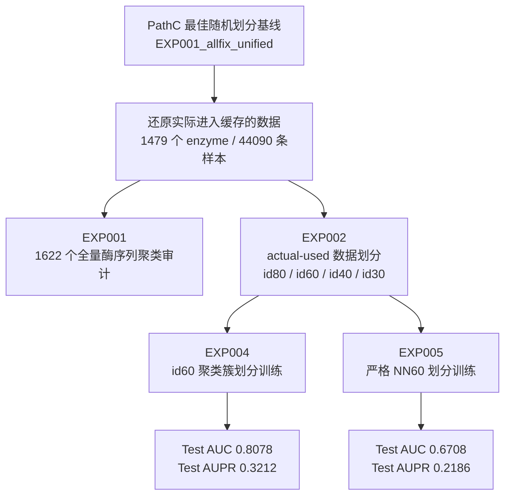

# Q2 序列相似度划分实验汇总

更新日期：2026-05-23

本文用于组会或后续 PPT 汇报前快速看懂 Q2。它整理三件事：

1. 之前随机划分实验得到什么结果。
2. Q2 这次具体做了哪些数据划分和训练。
3. 指标如何变化，以及这组变化应该怎么解释。

## 1. 当前结论

Q2 已经完成两组可以汇报的正式训练：

| 实验 | 数据划分方式 | Test AUC | Test AUPR | 可以说明什么 |
|---|---|---:|---:|---|
| EXP004 | id60 聚类簇不跨 train / val / test | 0.8078 | 0.3212 | 按序列聚类后，模型仍有一定泛化能力 |
| EXP005 | 严格 NN60，test/val 到 train 无 `>=60%` 近邻 | 0.6708 | 0.2186 | 严格限制近缘酶后，任务明显变难 |

老师提出的“限定 test 与 train 序列相似度 <60%”这条要求，当前由 EXP005 回答。EXP004 有参考价值，但不能写成严格 `<60%`，因为后续审计发现 test 和 train 之间仍有少量 `>=60%` 近邻。

## 2. 之前随机划分实验结果

下面是 PathC clean allfix 系列的历史结果。它们使用随机划分，是 Q2 的背景对照。

证据来源：

- `毕业设计/毕业论文/调研汇总/06_服务器端实锤核对.md`
- `毕业设计/毕业论文/调研汇总/04_PathC3_EXP001_EXP005全链路.md`
- `PathD_计划与进度.md` 与各 Q session 日志

| 历史实验 | 主要变化 | Test AUC | Test AUPR | 相对原架构 AUC 变化 | 相对原架构 AUPR 变化 |
|---|---|---:|---:|---:|---:|
| EXP001_allfix_unified | 原架构基线，28 维 | 0.9320 | 0.6749 | 0 | 0 |
| EXP002a_allfix_unified | 加 Fe/HEM 特征，31 维 | 0.9270 | 0.6300 | -0.0050 | -0.0449 |
| EXP003_allfix_unified | 加残基几何特征，37 维 | 0.9300 | 0.6426 | -0.0020 | -0.0323 |
| EXP005_dualgraph_2plus | 加残基级 GVP 双图通路 | 0.9253 | 0.6174 | -0.0067 | -0.0575 |

这组历史实验的核心含义是：索引和特征错配修复后，原架构基线反而最强；Fe/HEM、残基几何、GVP 双图通路在随机划分下没有带来稳定增益。

这也是 Q2 的动机：随机划分下的 0.9320 可能受到近缘酶影响。Q2 要检查，当测试集中的酶不再和训练集里的酶太像时，模型还能保持多少性能。

## 3. Q2 做了什么

Q2 没有重新计算 ESM、GROVER、Morgan 或对接图特征。它主要改变 train / val / test 的分配方式。

整体流程如下：



### 3.1 先确定真实参与训练的数据

一开始发现不能直接拿 `Enzymes.csv` 全量 1622 个酶做正式训练划分。原因是 PathC 最佳 baseline 的训练缓存实际只覆盖其中一部分酶。

最终 Q2 采用 `actual_used_baseline` 作为正式数据范围：

| 项目 | 数值 |
|---|---:|
| 实际使用 enzyme | 1479 |
| 实际使用 substrate | 2111 |
| 实际使用样本 | 44090 |
| 正样本 | 3913 |
| 负样本 | 40177 |

这样做的好处是：Q2 的新划分不会引入 baseline 没有真正用过的样本。

### 3.2 EXP001：全量 1622 酶聚类审计

EXP001 是上游审计，不作为正式训练数据入口。

| 阈值 | 聚类数 | 最大簇酶数 | 单酶簇数 | 平均每簇酶数 |
|---|---:|---:|---:|---:|
| id80 | 1139 | 19 | 900 | 1.42 |
| id60 | 758 | 38 | 496 | 2.14 |
| id40 | 328 | 148 | 162 | 4.95 |
| id30 | 140 | 481 | 65 | 11.59 |

这个审计说明：阈值越低，越多酶会被合并到同一簇，划分会更严格，训练集可用的独立簇数量也会减少。

### 3.3 数据划分方式详解

这里先把“划分”这件事说清楚。Q2 的基本单位有三层：

| 层级 | 含义 | 在 Q2 里怎么用 |
|---|---|---|
| 样本 | 一条 enzyme-substrate 组合，带正负标签 | 最终进入 train / val / test 的训练记录 |
| enzyme | 一个酶序列，对应很多条底物样本 | Q2 不把同一个 enzyme 拆到不同 split |
| cluster | 一组序列相似的 enzyme | EXP004 里作为最小分配单位 |

原随机划分可以理解为：很多样本已经被分进 train / val / test，但这个分配主要围绕样本本身。Q2 重新划分时，先把 baseline 实际用过的 train / val / test 合并回一个池子：

```text
原 baseline train 样本
原 baseline val 样本
原 baseline test 样本
        ↓
合并成 44090 条 actual-used 样本
        ↓
按 Q2 新规则重新分成 train / val / test
```

合并以后，旧的 train / val / test 身份只作为来源记录保存，不决定新划分。新的 split 由 enzyme 序列关系决定。

#### EXP004 的划分规则：按 id60 cluster 整体分配

EXP004 使用的是 EXP002 的 id60 候选划分。步骤如下：

1. 对 1479 个实际使用 enzyme 做序列相似度聚类，得到 id60 clusters。
2. 每个 cluster 里包含 1 个或多个 enzyme。
3. 找出这些 enzyme 对应的所有样本。
4. 把整个 cluster 分配给 train、val 或 test 中的一个。
5. cluster 里的所有 enzyme 和所有样本跟着一起进入同一个 split。

举一个简化例子：

| cluster | 包含的 enzyme | 这些 enzyme 的样本数 | 分配结果 |
|---|---|---:|---|
| C1 | E1, E2, E3 | 120 | train |
| C2 | E4 | 35 | test |
| C3 | E5, E6 | 80 | val |

那么 C1 里的 E1/E2/E3 以及它们所有底物样本都会进入 train。C1 不会被拆成一半 train、一半 test。

EXP004 能保证：

- 同一个 id60 cluster 不跨 train / val / test。
- 同一个 enzyme 不跨 train / val / test。
- 完全相同序列的 enzyme 不跨 train / val / test。
- 44090 条样本都被重新分配，没有丢失。

EXP004 不能保证：

- 任意一个 test enzyme 和任意一个 train enzyme 的序列相似度都低于 60%。

原因是 MMseqs2 的 cluster 是一种聚类结果，不能直接等同于“所有不同 cluster 之间都低于 60%”。所以 EXP004 后面还需要额外做最近邻检查。

#### EXP005 的划分规则：按 60% 相似关系形成的连通分量整体分配

EXP005 是为了更直接回答老师提出的“test 与 train 序列相似度 <60%”。

它的生成过程比 EXP004 更严格：

1. 对 actual-used 的 1479 个 enzyme 做 MMseqs2 全量两两搜索（all-vs-all）。
2. 只保留 `序列相似度 >=60%` 且 `覆盖度 >=80%` 的 enzyme-enzyme 关系。
3. 把这些关系看成一张图：enzyme 是点，`>=60%` 相似关系是边。
4. 把这张图切成连通分量（connected component）。一个连通分量里可能有 1 个 enzyme，也可能有多个彼此连通的 enzyme。
5. 分 train / val / test 时，一个连通分量整体进入同一个 split。
6. 连通分量里的所有 enzyme，以及这些 enzyme 对应的所有样本，跟着一起进入同一个 split。

举一个简化例子：

```text
E1 和 E2 相似度 65%，覆盖度 90%
E2 和 E3 相似度 62%，覆盖度 85%
E4 和它们都没有达到 60%

那么：
连通分量 A = E1, E2, E3
连通分量 B = E4

划分时：
连通分量 A 整体进入 train 或 val 或 test
连通分量 B 也整体进入某一个 split
```

这样处理后，只要全量两两搜索捕获到了 60% 相似关系，这些有关系的 enzyme 就会被绑在同一个连通分量里。连通分量整体分配以后，test 和 train 之间就不会再出现这种 `>=60%` 相似边。

EXP005 生成后还做了一次严格审计。检查规则是：

```text
test enzyme 逐个对 train enzyme 搜索
val enzyme 逐个对 train enzyme 搜索

如果发现：
序列相似度 >= 60%
并且覆盖度 >= 80%

这条划分就不合格。
```

覆盖度 `>=80%` 的意思是：两条序列参与对齐的部分要足够长。这样可以避免只因为很短的一小段相似，就把两条整体差异很大的酶误判为近邻。

EXP005 的连通分量统计：

| 项目 | 数值 |
|---|---:|
| 连通分量数 | 670 |
| 最大连通分量 enzyme 数 | 39 |
| 最大连通分量 sample 数 | 1283 |

EXP005 最终通过的结果是：

| 检查方向 | `>=60%` 且覆盖度 `>=80%` 的跨集合命中 |
|---|---:|
| test vs train | 0 |
| val vs train | 0 |

这可以换成更直白的话：

- 从 test 中任意拿出一个 enzyme，在覆盖度至少 80% 的前提下，它和 train 中任意 enzyme 的最高相似度都没有达到 60%。
- 从 val 中任意拿出一个 enzyme，在覆盖度至少 80% 的前提下，它和 train 中任意 enzyme 的最高相似度也没有达到 60%。

所以 EXP005 比 EXP004 更严格。EXP004 管的是“同一个聚类簇不要跨集合”；EXP005 直接检查“test/val 到 train 是否还有 60% 以上近邻”。

#### EXP004 和 EXP005 的划分差别

| 问题 | EXP004 id60 聚类簇划分 | EXP005 strict NN60 划分 |
|---|---|---|
| 分组单位 | MMseqs2 id60 聚类簇 | 60% 相似关系形成的连通分量 |
| 样本怎么走 | cluster 分到哪个 split，cluster 内所有样本就进入哪个 split | 连通分量分到哪个 split，连通分量内所有样本就进入哪个 split |
| 是否保证同一个 enzyme 不跨集合 | 是 | 是 |
| 是否保证完全相同序列不跨集合 | 是 | 是 |
| 是否保证 test 到 train 无 `>=60%` 命中 | 不能保证，后续审计发现少量命中 | 能保证，审计命中数为 0 |
| 适合怎么汇报 | id60 聚类簇划分结果 | strict NN60 严格划分结果 |
| 是否正面回答老师 `<60%` 要求 | 只能作为参考 | 可以正面回答 |

#### 新划分如何尽量保持样本比例

Q2 重新划分时，脚本会尽量让新 split 接近原 baseline 的规模。

原 baseline 的目标规模大致是：

| split | 目标样本数 | 目标正样本数 |
|---|---:|---:|
| train | 22083 | 1971 |
| val | 11008 | 958 |
| test | 10999 | 984 |

实际生成时会优先满足两件事：

1. 一个 cluster 或 enzyme 不能拆开。
2. train / val / test 的样本数和正样本数尽量接近原 baseline。

因此最终样本数不会和原 baseline 完全相同，但会尽量接近。

### 3.4 EXP002：实际使用数据的候选划分

EXP002 基于 actual-used 的 1479 个酶和 44090 条样本，生成四套候选划分。

| 阈值 | train 样本 / 酶 | val 样本 / 酶 | test 样本 / 酶 | 聚类泄漏 | 酶泄漏 | 重复序列泄漏 |
|---|---:|---:|---:|---:|---:|---:|
| id80 | 22031 / 828 | 11021 / 327 | 11038 / 324 | 0 | 0 | 0 |
| id60 | 21975 / 804 | 11008 / 323 | 11107 / 352 | 0 | 0 | 0 |
| id40 | 20254 / 671 | 12515 / 433 | 11321 / 375 | 0 | 0 | 0 |
| id30 | 20110 / 631 | 12807 / 490 | 11173 / 358 | 0 | 0 | 0 |

EXP002 的 id60 后来作为 EXP004 训练入口。这里的“通过审计”指的是：

- 同一个聚类簇不会同时出现在 train / val / test。
- 同一个 enzyme 不会跨 train / val / test。
- 完全相同序列的 enzyme 不会跨 train / val / test。
- 44090 条 actual-used 样本全部被覆盖，没有丢样本。

### 3.5 EXP004：id60 聚类簇划分训练

EXP004 采用 EXP002 的 id60 划分，训练 GDTable 版本模型。

| 项目 | 数值 |
|---|---:|
| train 样本 | 21975 |
| val 样本 | 11008 |
| test 样本 | 11107 |
| test 正样本 | 1006 |
| test 负样本 | 10101 |
| 最佳验证 AUC | 0.762133 |
| 最佳验证 AUC epoch | 17 |
| 对应验证 AUPR | 0.312507 |
| Test AUC | 0.807786 |
| Test AUPR | 0.321236 |

EXP004 证明：把同一 id60 聚类簇限制在同一个 split 里后，模型仍能训练并得到完整结果。

后续严格审计发现，EXP004 仍有少量 test-train `>=60%` 近邻。因此它适合汇报为“id60 聚类簇划分”，不适合汇报为“严格 test-train <60%”。

### 3.6 EXP005：严格 NN60 划分训练

EXP005 在 EXP004 的基础上继续收紧划分规则。它检查 test/val 中每个酶到 train 酶的最近邻，要求不存在 `>=60%` 且覆盖度 `>=80%` 的跨集合命中。

数据划分：

| split | 样本数 | 酶数 | 正样本 | 负样本 | 正样本比例 |
|---|---:|---:|---:|---:|---:|
| train | 22010 | 794 | 1864 | 20146 | 8.47% |
| val | 10989 | 330 | 1043 | 9946 | 9.49% |
| test | 11091 | 355 | 1006 | 10085 | 9.07% |

严格相似度审计：

| 检查项 | 结果 |
|---|---:|
| test vs train 中 `>=60%` 且覆盖度 `>=80%` 的命中 | 0 |
| val vs train 中 `>=60%` 且覆盖度 `>=80%` 的命中 | 0 |
| test 中每个酶对 train 的最高近邻相似度 | 59.3% |
| val 中每个酶对 train 的最高近邻相似度 | 59.9% |
| 重复序列跨集合 | 0 |
| 酶跨集合 | 0 |
| 样本覆盖缺失 | 0 |

训练结果：

| 项目 | 数值 |
|---|---:|
| 最佳验证 AUC | 0.728141 |
| 最佳验证 AUC epoch | 23 |
| 最佳验证 AUPR | 0.244256 |
| 最佳验证 AUPR epoch | 31 |
| Test AUC | 0.670801 |
| Test AUPR | 0.218569 |
| 训练结束 epoch | 38 |
| 训练耗时 | 约 51 分钟 |

EXP005 是目前最能回答老师问题的结果：当 test/val 中的酶对 train 没有 `>=60%` 近邻时，测试性能明显下降。

## 4. 指标如何变化

### 4.1 从随机划分到 Q2 新划分

下面这张表把 PathC 随机划分基线和 Q2 两个正式结果放在一起。需要注意：PathC 基线是历史最优随机划分结果，Q2 是 PathD 新划分结果。它们共同说明趋势，但最严格的比较应继续使用同一套训练脚本和设置补一个 random split 对照。

| 实验 | 划分方式 | Test AUC | Test AUPR | 相对随机划分基线 AUC 变化 | 相对随机划分基线 AUPR 变化 |
|---|---|---:|---:|---:|---:|
| PathC EXP001_allfix_unified | 随机划分 | 0.9320 | 0.6749 | 0 | 0 |
| Q2 EXP004 | id60 聚类簇划分 | 0.8078 | 0.3212 | -0.1242 | -0.3537 |
| Q2 EXP005 | 严格 NN60 划分 | 0.6708 | 0.2186 | -0.2612 | -0.4563 |

这个变化说明：随机划分下的高分很可能受近缘酶影响。随着划分越来越强调“新酶泛化”，模型性能会下降。

### 4.2 EXP004 到 EXP005 的变化

EXP004 和 EXP005 更适合放在一起比较，因为它们都在 Q2 路线里完成，训练配置也更接近。

| 对比 | AUC 变化 | AUPR 变化 | 含义 |
|---|---:|---:|---|
| EXP005 相对 EXP004 | -0.1370 | -0.1027 | 从“同簇不跨集合”进一步变成“test/val 到 train 无 `>=60%` 近邻”后，评估更难 |

这一对比是 Q2 最清楚的内部结果。EXP004 表明聚类划分已经降低了随机划分的乐观程度；EXP005 进一步表明严格 NN60 会显著提高泛化难度。

## 5. 可以放进 PPT 的讲法

建议 PPT 分成三页：

### 第 1 页：为什么要做 Q2

随机划分可能让相似酶同时进入训练集和测试集。模型可能借助近缘酶记忆取得高分。老师提出按序列相似度划分，是为了测试模型在“更像新酶”的场景下还能表现如何。

### 第 2 页：Q2 实验流程

从 PathC 最佳基线出发，先还原实际参与训练的 1479 个酶和 44090 条样本，再做序列聚类和新划分。EXP004 使用 id60 聚类簇划分，EXP005 进一步保证 test/val 对 train 无 `>=60%` 近邻。

### 第 3 页：指标变化

| 结果 | Test AUC | Test AUPR |
|---|---:|---:|
| 随机划分基线 | 0.9320 | 0.6749 |
| id60 聚类簇划分 | 0.8078 | 0.3212 |
| 严格 NN60 划分 | 0.6708 | 0.2186 |

可以讲的结论：

- Q2 没有改模型主架构，主要改变数据划分。
- 划分越严格，测试性能越低。
- EXP005 回答了老师提出的 `<60%` 相似度约束。
- 这说明原随机划分结果不能直接代表远缘新酶泛化能力。

## 6. 不能混入正式结果的内容

以下内容只作为工程过程记录，不适合当正式实验结果：

| 内容 | 原因 |
|---|---|
| EXP003 早期 id60 训练 | 后来发现指标记录和训练流程需要修正 |
| batch 64 / 72 / 80 / 88 的一轮测试 | 主要用于显存和 GPU 利用率调试 |
| 5 epoch 稳定性测试 | 用于确认脚本能跑，不是完整训练 |
| GPU utilization profiling | 工程性能诊断，不能解释科学结论 |

正式 Q2 结果目前只建议使用 EXP004 和 EXP005。

## 7. 证据路径

本地 Q2 日志：

```text
D:\EZSpecificity_Project\毕业设计\P450_EZSpecificity_研究项目\PathD_2026-05-08_导师反馈13问题\sessions\02_Q2_序列相似度划分\session_log.md
```

服务器 Q2 数据：

```text
/root/autodl-tmp/EZSpecificity/PathD/P450/data/q02_sequence_similarity_split/
```

服务器 Q2 实验：

```text
/root/autodl-tmp/EZSpecificity/PathD/P450/experiments/q02_sequence_similarity_split/
```

EXP004 结果：

```text
/root/autodl-tmp/EZSpecificity/PathD/P450/experiments/q02_sequence_similarity_split/EXP004_id60_gdtable/results/test_eval.json
/root/autodl-tmp/EZSpecificity/PathD/P450/experiments/q02_sequence_similarity_split/EXP004_id60_gdtable/results/metrics.csv
```

EXP005 结果：

```text
/root/autodl-tmp/EZSpecificity/PathD/P450/experiments/q02_sequence_similarity_split/EXP005_strict_nn60_gdtable/results/test_eval.json
/root/autodl-tmp/EZSpecificity/PathD/P450/experiments/q02_sequence_similarity_split/EXP005_strict_nn60_gdtable/results/metrics.csv
```

历史 PathC 指标核对：

```text
D:\EZSpecificity_Project\毕业设计\毕业论文\调研汇总\06_服务器端实锤核对.md
D:\EZSpecificity_Project\毕业设计\毕业论文\调研汇总\04_PathC3_EXP001_EXP005全链路.md
```

## 8. 下一步建议

短期最值得做的是把本文内容整理成 PPT 图表。若老师要求更严格的证据，再考虑补做一个“同一套 PathD GDTable 训练脚本 + random split”的对照训练。这样可以把随机划分、id60 聚类簇划分、strict NN60 划分放在同一套代码和训练设置下比较。
