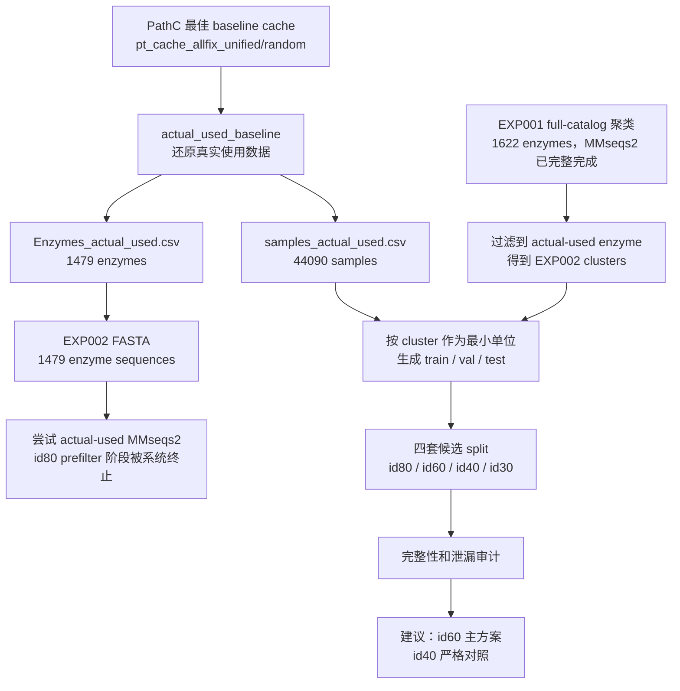
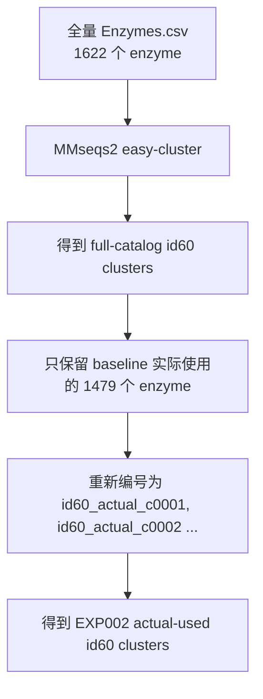
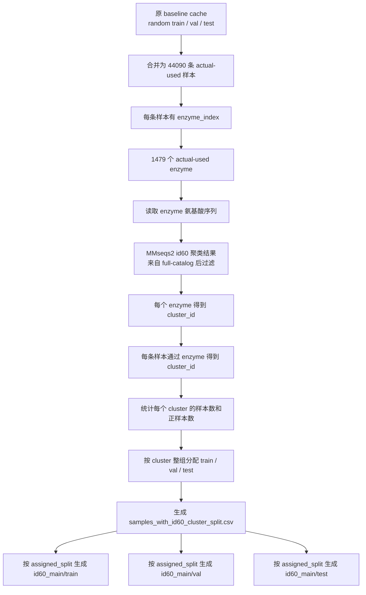
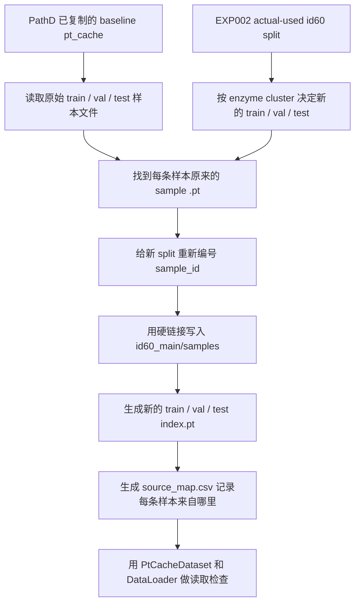

# Q2：序列相似度划分

## 先看这里：当前状态

Q2 要处理的是数据划分范围和规则。现在采用的做法是：先取 baseline 真正用过的酶和样本，再按酶序列相似度分组，最后按组划分 train / val / test。这样可以降低相似酶同时出现在训练集和测试集里的风险，测试结果会更接近“新酶泛化”场景。

当前最重要的结论：

| 问题 | 现在的答案 |
|---|---|
| 现在正式按哪批数据做？ | **EXP002 actual-used**，也就是 baseline 实际用过的 1479 个 enzyme / 44090 条样本。 |
| EXP001 是什么？ | 全量 1622 enzyme 的归档审计，只作为上游参考。 |
| Q2 split 做完了吗？ | **候选 split 已完成**：id80 / id60 / id40 / id30 四套都生成并通过审计。 |
| 现在推荐先用哪套？ | **id60 作为主方案**，id40 作为更严格的对照。 |
| 现在还没做什么？ | 还没有把 split 重建成训练用 pt_cache，也还没有开始训练，训练要等 GPU 模式。 |
| 最大限制是什么？ | EXP002 的 cluster 来源于 EXP001 全量聚类过滤，actual-used 原地重跑 MMseqs2 目前没有完成。这个限制已记录。 |

我实际做的事情可以按这个顺序理解：

```text
PathC 最佳 baseline cache
  ↓
还原 baseline 真正用过的数据 actual_used_baseline
  ↓
得到 1479 个实际 enzyme 和 44090 条实际样本
  ↓
用序列相似度 cluster 约束 train / val / test 划分
  ↓
生成 id80 / id60 / id40 / id30 四套候选 split
  ↓
检查有没有漏样本、有没有相似酶泄漏到不同 split
  ↓
建议后续先用 id60 重建训练缓存并训练，id40 做严格对照
```

当前可以继续往下做。下一步应选择 id60 主方案，重建对应训练缓存，然后等 GPU 模式启动训练；id40 可以作为更严格的对照方案。

## 老师原话

> 按照序列相似度进行划分

## 状态

🟡 **数据划分阶段已完成；训练阶段未开始（PathD/EXP002 actual-used）**

## 实施位置

服务器 PathD 正式执行区：

`/root/autodl-tmp/EZSpecificity/PathD/P450`

当前主线实验目录（实际 baseline 使用数据，1479 enzyme / 44090 samples）：

`/root/autodl-tmp/EZSpecificity/PathD/P450/experiments/q02_sequence_similarity_split/EXP002_actual_used_cache_valid`

当前主线数据输出目录：

`/root/autodl-tmp/EZSpecificity/PathD/P450/data/q02_sequence_similarity_split/exp002_actual_used_cache_valid`

公共实际使用数据入口：

`/root/autodl-tmp/EZSpecificity/PathD/P450/data/actual_used_baseline`

全量 1622 酶审计归档目录（不作为当前正式实验入口）：

`/root/autodl-tmp/EZSpecificity/PathD/P450/data/q02_sequence_similarity_split/exp001_full_catalog_1622`

旧 PathC/EXP006 不继续执行，仅作为历史参考。

## 当前进度（截至 2026-05-21）

### EXP002 actual-used 主线（1479 enzyme / 44090 samples）

| 阶段 | 状态 | 备注 |
|---|---|---|
| `actual_used_baseline` 公共数据入口 | ✅ | 已从 baseline cache 物化真实使用数据 |
| actual-used 样本表 | ✅ | 44090 样本；train 22083 / val 11008 / test 10999 |
| actual-used 酶表 | ✅ | 1479 enzyme；相对全量 1622 缺失 143 |
| actual-used FASTA 导出 | ✅ | 1479 酶 → 1469 唯一序列 / 10 重复组 / 20 酶 |
| 序列基础审计 | ✅ | 无空序列、无非法字符，长度 60–853 aa |
| cache 与 PT CSV 对齐 | ✅ | enzyme/substrate mismatch 均为 0 |
| EXP002 actual-used cluster 派生 | ✅ | 从 EXP001 全量 MMseqs2 聚类过滤到 1479 个 actual-used enzyme |
| EXP002 cluster split 生成 | ✅ | 已生成 id80/id60/id40/id30 四套候选 split |
| EXP002 split 泄漏审计 | ✅ | cluster / enzyme / 重复序列跨 split 泄漏均为 0 |
| pt_cache 重建 | ⏳ | 待 cluster split 完成后启动 |
| 训练 | ⏳ | 等 GPU 模式 |
| 评估 | ⏳ | 待训练完成后进行 |

### EXP001 full-catalog 归档（1622 enzyme / 52254 samples）

以下结果只作为全量上游审计和历史参考，不作为当前正式 Q2 实验入口。

| 阶段 | 状态 | 备注 |
|---|---|---|
| PathD Q2 全量审计骨架 | ✅ | 已归档到 `exp001_full_catalog_1622/` |
| FASTA 导出 | ✅ | 1622 酶 → 1609 唯一序列 / 11 重复组 / 24 酶 |
| 序列基础审计 | ✅ | 无空序列、无非法字符，长度 60–1572 aa |
| MMseqs2 定位 | ✅ | `/root/miniconda3/bin/mmseqs` |
| 4 阈值聚类 | ✅ | id80 / id60 / id40 / id30 |
| TSV 解析为标准 CSV | ✅ | 输出已归档到 `exp001_full_catalog_1622/clusters/mmseqs/` |
| 样本平衡审计 | ✅ | 已映射回 52254 条样本和 4751 个正样本 |

## EXP002 actual-used 审计摘要（当前主线）

当前使用的数据：

| 指标 | 数值 |
|---|---:|
| 实际 enzyme | 1479 |
| 实际 substrate | 2111 |
| 实际样本 | 44090 |
| 正样本 | 3913 |
| 负样本 | 40177 |

序列审计：

| 指标 | 数值 |
|---|---:|
| 酶序列总数 | 1479 |
| 空序列 | 0 |
| 非法字符序列 | 0 |
| 唯一精确序列 | 1469 |
| 精确重复序列组 | 10 |
| 位于重复序列组的酶 | 20 |
| 序列长度范围 | 60–853 aa |
| 平均 / 中位长度 | 496.86 / 506 aa |

聚类来源：`filtered_from_EXP001_full_catalog_1622_mmseqs_clusters`。说明：EXP002 的 actual-used MMseqs2 原地重跑未完成；id80 `easy-cluster` 曾在 prefilter 阶段被系统终止。本次候选 split 使用已成功完成的 EXP001 全量 1622 酶 MMseqs2 聚类结果，过滤到 actual-used 1479 酶集合。

EXP002 阈值摘要：

| 阈值 | clusters | enzyme | 最大序列簇 | singletons | 完整性 |
|---|---:|---:|---:|---:|---|
| id80 | 1044 | 1479 | 18 | 830 | 通过 |
| id60 | 691 | 1479 | 37 | 457 | 通过 |
| id40 | 306 | 1479 | 138 | 154 | 通过 |
| id30 | 127 | 1479 | 455 | 60 | 通过 |

EXP002 split 分布：

| 阈值 | split | 样本 | 正样本 | 负样本 | enzyme | cluster |
|---|---|---:|---:|---:|---:|---:|
| id80 | train | 22031 | 1776 | 20255 | 828 | 709 |
| id80 | val | 11021 | 1084 | 9937 | 327 | 165 |
| id80 | test | 11038 | 1053 | 9985 | 324 | 170 |
| id60 | train | 21975 | 1861 | 20114 | 804 | 504 |
| id60 | val | 11008 | 1046 | 9962 | 323 | 106 |
| id60 | test | 11107 | 1006 | 10101 | 352 | 81 |
| id40 | train | 20254 | 1846 | 18408 | 671 | 187 |
| id40 | val | 12515 | 1044 | 11471 | 433 | 76 |
| id40 | test | 11321 | 1023 | 10298 | 375 | 43 |
| id30 | train | 20110 | 1887 | 18223 | 631 | 64 |
| id30 | val | 12807 | 983 | 11824 | 490 | 32 |
| id30 | test | 11173 | 1043 | 10130 | 358 | 31 |

完整性检查：

- 四个阈值均覆盖 44090 条 actual-used 样本。
- 四个阈值均无 cluster 跨 train/val/test。
- 四个阈值均无 enzyme 跨 train/val/test。
- 四个阈值均无精确重复序列组跨 train/val/test。
- 补强验证后，四个阈值均通过 sample key 多重集合核对。
- 补强验证后，四个阈值均确认 cluster enzyme set 与 split sample enzyme set 一致。
- 补强验证后，actual-used 10 组重复序列中的 enzyme 均没有静默缺失。
- 当前主候选建议：id60；严格对照候选：id40。

## EXP002 actual-used 详细流程说明（给自己看的版）

### 这一步到底想解决什么

Q2 要回答的问题是：

> 如果测试集里的酶，在序列上不能和训练集里的酶太像，模型表现还好吗？

原来的 random split 会把相同 enzyme、相似 enzyme 甚至完全相同序列的 enzyme 分散到 train/val/test。模型可能只是记住了很像的酶，测试结果会偏乐观。

因此 EXP002 的目标是：

1. 只使用 baseline 实际训练/验证/测试用到的数据，也就是 `actual_used_baseline`。
2. 先按 enzyme 序列相似性把 enzyme 聚成 cluster。
3. 再以 cluster 为最小单位分 train/val/test。
4. 保证同一个 cluster 只能出现在一个 split 里。

### 流程图



### 为什么没有把 EXP002 MMseqs2 写成已完成

EXP002 的 FASTA 已经生成，但 actual-used MMseqs2 原地重跑时，id80 的 `easy-cluster` 在 prefilter 阶段被系统终止。为了不被这个步骤卡死，当前采用了一个保守替代方案：

1. EXP001 已经对全量 1622 个 enzyme 成功跑完 MMseqs2。
2. EXP002 的 1479 个 enzyme 是这 1622 个 enzyme 的子集。
3. 所以先从 EXP001 的全量聚类结果里，把不属于 actual-used 的 enzyme 过滤掉。
4. 得到 EXP002 actual-used clusters。

这个做法的好处是：当前 split 的样本、enzyme 和 cluster 都来自 actual-used 这批数据，不再使用 1622 全量样本做训练划分。

这个做法的限制也已经记录：cluster 来源是 `filtered_from_EXP001_full_catalog_1622_mmseqs_clusters`。EXP002 actual-used MMseqs2 原地重跑结果目前不存在。如果后续必须做到最严格复现，可以再单独重跑 actual-used MMseqs2 并对比。

### split 具体是怎么生成的

这里的 split 按 **cluster** 分，不按单条样本或单个 enzyme 随机分。

以 id60 为例：

1. 先拿到 id60 的 actual-used clusters。
2. 对每个 cluster 统计：
   - 这个 cluster 有多少 samples。
   - 有多少 positive samples。
   - 有多少 negative samples。
   - 有多少 enzyme。
   - 有多少 substrate。
3. 然后把 cluster 一个个分到 train、val、test。
4. 一个 cluster 一旦分到 train，它里面所有 enzyme 的所有样本都只能进 train；不能拆到 val 或 test。

目标规模尽量靠近原 baseline actual-used split：

| split | 目标样本数 | 目标正样本数 |
|---|---:|---:|
| train | 22083 | 1971 |
| val | 11008 | 958 |
| test | 10999 | 984 |

具体分配策略：

1. 对每个阈值分别生成 split：id80、id60、id40、id30。
2. 每个阈值尝试 800 个随机种子。
3. 每个种子下，先打乱 cluster，再按 cluster 的样本数、正样本数、enzyme 数从大到小处理。
4. 每处理一个 cluster，就尝试把它放进 train、val、test 三个位置。
5. 选择当前让整体误差最小的位置。

误差主要看三件事：

- 样本总数是否接近目标。
- 正样本数是否接近目标。
- cluster 数量是否大致合理。

这里正样本数权重更高，因为 P450 正样本比较少，正样本分布失衡会直接影响 AUC/AUPR 的可信度。

最后每个阈值保留误差最低的一套 split。

### 四套 split 的直观解释

| 阈值 | 含义 | 结果直观解释 | 当前判断 |
|---|---|---|---|
| id80 | 80% 序列相似度聚类 | cluster 很细，1044 个 cluster，830 个 singleton | 太接近随机，泛化压力偏弱 |
| id60 | 60% 序列相似度聚类 | 691 个 cluster，最大 cluster 37 个 enzyme，样本分布较平衡 | 推荐主方案 |
| id40 | 40% 序列相似度聚类 | 306 个 cluster，最大 cluster 138 个 enzyme，更严格但更难平衡 | 推荐严格对照 |
| id30 | 30% 序列相似度聚类 | 127 个 cluster，最大 cluster 455 个 enzyme | 太粗，不建议主用 |

## 完整性和泄漏审计到底是什么意思

下面这些检查的目的，是确认 split 没有丢数据、没有重复算数据，也没有把相似 enzyme 偷偷分到不同集合。

### 1. 覆盖 44090 条 actual-used 样本

意思是：

> `samples_actual_used.csv` 里原本有 44090 条样本，生成 split 之后，train + val + test 加起来仍然是 44090 条。

它防的是：

- 有样本在生成 split 时丢了。
- 有样本被重复放进多个 split。
- 只处理了部分数据。

这里还做了更严格的 sample key 多重集合核对。

sample key 指的是一条样本的身份信息：

```text
原始 split + cache_row + pt_csv_row + dock_index + enzyme_index + substrate_index + label
```

多重集合核对同时检查样本 key 和出现次数。这样即使有两条完全相同 key 的样本，也不会被普通 set 去重后漏掉。

### 2. 覆盖 1479 个 enzyme

意思是：

> actual-used 数据里共有 1479 个 enzyme，生成 cluster 和 split 后，这 1479 个 enzyme 都还在。

它防的是：

- 某些 enzyme 没有 cluster。
- 某些 enzyme 没有被分到任何 split。
- split 用到的 enzyme 集合和 actual-used enzyme 集合对不上。

### 3. cluster 不跨 train/val/test

cluster 是一组序列相似的 enzyme。

这条检查的意思是：

> 同一个 cluster 只能属于 train、val、test 中的一个。

例如某个 id60 cluster 里有 20 个相似 enzyme，那么这 20 个 enzyme 要么都进 train，要么都进 val，要么都进 test，不能拆开。

它防的是最核心的序列相似性泄漏：

- train 里有某个 enzyme；
- test 里有一个和它序列很像的 enzyme；
- 模型可能靠“见过相似 enzyme”得到偏乐观结果。

### 4. enzyme 不跨 train/val/test

这条比 cluster 更基础。

意思是：

> 同一个 enzyme 的所有样本，只能出现在一个 split 里。

例如 enzyme 123 有 30 条不同底物样本，那么这 30 条样本不能一部分进 train，一部分进 test。

它防的是：

- 模型在 train 见过 enzyme 123；
- test 又考 enzyme 123 的其他底物；
- 评估范围退化成“同一个 enzyme 的新底物”，无法代表“新 enzyme 泛化”。

### 5. 精确重复序列组不跨 train/val/test

有些 enzyme 的 ID 不同，但蛋白序列完全一样。

这条检查的意思是：

> 如果两个 enzyme 的序列 100% 一样，它们必须在同一个 split。

它防的是：

- train 里一个 enzyme；
- test 里另一个 enzyme；
- 它们名字不同，但序列完全相同；
- 模型其实已经见过同样的蛋白序列。

actual-used 里有 10 组精确重复序列，涉及 20 个 enzyme。四个候选 split 都确认没有把这些组拆开。

### 6. sample key 多重集合核对通过

这条是为了防止“看起来行数对了，但具体样本错了”。

检查方式是：

1. 从原始 `samples_actual_used.csv` 取出所有样本 key。
2. 从生成后的 split 文件中取出所有样本 key。
3. 比较两边的 key 和出现次数是否完全一致。

如果通过，说明：

- split 没有丢样本。
- split 没有复制样本。
- split 没有把 label、enzyme、substrate 搞错。

### 7. cluster enzyme set 与 split sample enzyme set 一致

意思是：

> cluster 文件里的 enzyme 集合，必须等于 split 样本实际涉及的 enzyme 集合。

它防的是：

- cluster 里有 enzyme，但样本 split 里没有。
- 样本里有 enzyme，但 cluster 文件里没有。
- 聚类结果和样本表的 enzyme 批次不一致。

### 8. 重复序列组里的 enzyme 没有静默缺失

这个是独立复核后补强的检查。

原来的检查会看重复序列组有没有跨 split，但如果某个重复序列组里的 enzyme 根本没进入 split，理论上可能被跳过。

现在补强为：

> 每个重复序列组里的 enzyme，都必须明确存在于 actual-used split 中，然后再检查它们是否跨 split。

它防的是：

- 重复序列审计表里有 enzyme；
- split 文件里没有这个 enzyme；
- 脚本却没有报错。

### 这些检查通过后，说明什么

可以说明：

1. EXP002 actual-used 的四套候选 split 在数据完整性上成立。
2. 样本、enzyme、cluster 三层没有明显错位。
3. 同一 enzyme、相似 enzyme cluster、完全重复序列都没有跨 train/val/test。
4. 当前可以进入“选定主阈值并重建 pt_cache”的阶段。

还不能说明：

1. 模型效果一定好。
2. Q2 已经完成训练。
3. 底物侧没有泄漏。
4. actual-used MMseqs2 原地重跑已经完成。

所以当前最准确状态是：

> EXP002 actual-used 的候选序列相似度划分已经完成并通过数据审计；下一步是选择 id60 主方案、id40 严格对照，然后重建对应 pt_cache 并训练。

## EXP001 full-catalog 序列审计摘要（归档，不作为当前主线）

| 指标 | 数值 |
|---|---:|
| 酶序列总数 | 1622 |
| 空序列 | 0 |
| 非法字符序列 | 0 |
| 唯一精确序列 | 1609 |
| 精确重复序列组 | 11 |
| 位于重复序列组的酶 | 24 |
| 序列长度范围 | 60–1572 aa |
| 平均 / 中位长度 | 508.80 / 506 aa |

## EXP001 full-catalog MMseqs2 聚类摘要（归档，不作为当前主线）

参数：`easy-cluster`，`--min-seq-id` 分别为 0.8 / 0.6 / 0.4 / 0.3，覆盖度 `-c 0.8`，`--cov-mode 0`。

| 阈值 | clusters | 酶数 | 最大序列簇 | singletons |
|---|---:|---:|---:|---:|
| id80 | 1139 | 1622 | 19 | 900 |
| id60 | 758 | 1622 | 38 | 496 |
| id40 | 328 | 1622 | 148 | 162 |
| id30 | 140 | 1622 | 481 | 65 |

## EXP001 full-catalog 样本平衡审计（归档，不作为当前主线）

数据集总样本：52254；正样本：4751；负样本：47503。

| 阈值 | clusters | 单簇最大样本数 | 单簇最大正样本数 | p95 样本/簇 |
|---|---:|---:|---:|---:|
| id80 | 1139 | 2085 | 348 | 134 |
| id60 | 758 | 2111 | 350 | 239 |
| id40 | 328 | 4027 | 377 | 596 |
| id30 | 140 | 12990 | 982 | 1199 |

## 当前判断

- 2026-05-21 追加修正：当前 MMseqs2 聚类对象是 `Enzymes.csv` 全量 1622 条酶序列，适合作为全量 P450 酶序列审计；PathC/PathD baseline 实际使用的 `pt_cache_allfix_unified/random` 是过滤后的训练缓存数据。只读核对显示 fold0 cache 的 train/val/test 合并后覆盖 1479 个 enzyme，范围 0-1576。后续正式生成与 baseline 一致的 Q2 split 时，应以进入训练缓存的 enzyme/sample 集合为准，不能直接把 1622 酶聚类当成训练使用的数据范围。
- 2026-05-21 已将 Q2 数据层整理为 `exp001_full_catalog_1622/` 与 `exp002_actual_used_cache_valid/`，并新增公共数据入口 `data/actual_used_baseline/`。`actual_used_baseline` 物化了 baseline cache 真正读取的数据：1479 个 enzyme、2111 个 substrate、44090 条样本；cache 与 PT CSV 的 enzyme/substrate 对齐 mismatch 均为 0。
- 2026-05-21 已完成 EXP002 actual-used 的候选 cluster-held-out split：id80/id60/id40/id30 四套均通过完整性检查。当前 split 的 cluster 来源是从 EXP001 全量 1622 酶 MMseqs2 聚类中过滤 actual-used 1479 酶；EXP002 actual-used MMseqs2 原地重跑仍记录为 id80 prefilter 阶段被终止。
- 2026-05-21 split 后独立复核未发现阻塞性错误；复核提出的 sample key 多重集合核对和重复序列缺失硬校验已补强并重跑通过。
- `test_eval.json n_samples=11000` 与 `test/index.pt=10999` 的差异已追溯：真实 DataModule test dataset 为 10999 samples；训练结束的 4 卡 DDP auto-test 会把 10999 补齐到 11000，因此 actual-used 数据集仍以 cache index 的 10999 test samples 为准。
- 2026-05-21 整理后独立复核：Codex MCP 与 Codex 桥接均未成功返回结果（超时或网络受限），改用独立子代理只读审查。复核未发现 actual-used 统计或 EXP002 当前状态的明显实质错误；指出 `organize_q02_exp002_actual_used_20260521.py` 是一次性混合脚本，不适合后续无脑重跑。
- 在 actual-used 这批数据上，id60 样本分布最接近原 baseline 目标规模，可作为主候选。
- id40 更严格，但 train/val/test 样本更不平衡，可作为压力更大的对照候选。
- id30 最大簇仍过大（455 个 enzyme），不建议作为主实验。
- id80 singleton 太多（830 个），泛化压力较弱，不建议作为主实验。
- 2026-05-22 已完成 id60 主方案的训练缓存整理：`id60_main` 已能被 baseline 的 `PtCacheDataset` 和小批量 `DataLoader` 读取；曾短暂启动单卡训练，随后按用户要求停止并清理训练残留，正式训练尚未开始。

## 关键输出

- actual-used 公共数据：`/root/autodl-tmp/EZSpecificity/PathD/P450/data/actual_used_baseline/`
- EXP002 FASTA：`/root/autodl-tmp/EZSpecificity/PathD/P450/data/q02_sequence_similarity_split/exp002_actual_used_cache_valid/input/enzymes_actual_used.fasta`
- EXP002 聚类派生目录：`/root/autodl-tmp/EZSpecificity/PathD/P450/data/q02_sequence_similarity_split/exp002_actual_used_cache_valid/clusters/mmseqs_from_exp001_full_catalog/`
- EXP002 split 目录：`/root/autodl-tmp/EZSpecificity/PathD/P450/data/q02_sequence_similarity_split/exp002_actual_used_cache_valid/splits/`
- EXP002 split 报告：`/root/autodl-tmp/EZSpecificity/PathD/P450/data/q02_sequence_similarity_split/exp002_actual_used_cache_valid/reports/exp002_actual_used_split_report.md`
- EXP002 完整性验证：`/root/autodl-tmp/EZSpecificity/PathD/P450/data/q02_sequence_similarity_split/exp002_actual_used_cache_valid/reports/exp002_integrity_validation.md`
- EXP001 全量归档：`/root/autodl-tmp/EZSpecificity/PathD/P450/data/q02_sequence_similarity_split/exp001_full_catalog_1622/`
- id60 主方案训练缓存：`/root/autodl-tmp/EZSpecificity/PathD/P450/data/q02_sequence_similarity_split/exp002_actual_used_cache_valid/pt_cache/id60_main/`
- id60 缓存整理脚本：`/root/autodl-tmp/EZSpecificity/PathD/P450/scripts/q02_build_pt_cache_overlay_20260522.py`
- id60 缓存整理报告：`/root/autodl-tmp/EZSpecificity/PathD/P450/data/q02_sequence_similarity_split/exp002_actual_used_cache_valid/pt_cache/id60_main/reports/build_report.json`
- 服务器 session log：`/root/autodl-tmp/EZSpecificity/PathD/P450/sessions/q02_sequence_similarity_split/session_log.md`

## 给自己看的版：id60 cluster 到底怎么来的

### 先把任务拆开

“按照序列相似度划分”的完整动作可以拆成四步：

1. 每个 enzyme 有一条蛋白氨基酸序列。
2. 用 MMseqs2 比较这些序列，把相似的 enzyme 放进同一个 cluster。
3. 把整个 cluster 分给 train、val 或 test。
4. cluster 里的 enzyme 对应的所有样本，都跟着进入同一个 split。

所以一条样本最后去哪里，判断链条是：

```text
sample -> enzyme -> enzyme sequence -> id60 cluster -> assigned split
```

也就是：

```text
样本本身不单独决定 split
样本的 enzyme 决定 cluster
cluster 决定 split
```

### 什么是 enzyme sequence

每个 enzyme 都是一条蛋白序列，例如可以想象成这样：

```text
enzyme 36:
MALWMRLLPLLALLALWGPGPGAG...

enzyme 97:
MALWMRLLPLLALLALWGPGSGAG...

enzyme 251:
GSRVTVVYGPAGSGKST...
```

MMseqs2 会比较这些字符串代表的氨基酸序列。序列越像，说明这两个 enzyme 在蛋白层面越接近。

### id60 的意思

`id60` 来自 MMseqs2 聚类参数里的 `--min-seq-id 0.6`。

本项目使用的 full-catalog 聚类参数记录为：

```text
easy-cluster
--min-seq-id 0.6
-c 0.8
--cov-mode 0
```

这里可以先这样理解：

- `--min-seq-id 0.6`：序列相似度阈值是 60%。
- `-c 0.8`：比对覆盖度要求是 80%。
- `--cov-mode 0`：覆盖度计算方式使用 MMseqs2 的 mode 0。

因此，`id60 cluster` 可以理解为：

> MMseqs2 在 60% 序列相似度阈值和覆盖度要求下，把相似 enzyme 归成的一组。

更精确地说，一个 enzyme 会被分到某个代表序列所在的 cluster。这个 cluster 的成员满足 MMseqs2 的聚类规则。这里不能直接把它理解成“cluster 内任意两个 enzyme 两两之间都严格相似度 >= 60%”。它更接近“都能被 MMseqs2 归到同一组相似序列”。

### 本项目当前的 id60 cluster 来源

当前 Q2 的 id60 cluster 来源需要单独说明。EXP002 曾尝试对 1479 个 actual-used enzyme 原地跑 MMseqs2，但 id80 prefilter 阶段被系统终止，所以这次先使用已经成功完成的 full-catalog 聚类结果。

当前实际采用的是这个路线：



这件事的含义：

- 聚类背景来自 1622 个 full-catalog enzyme。
- 训练划分只使用 1479 个 actual-used enzyme。
- 进入 train/val/test 的样本只来自 baseline 实际使用的 44090 条样本。
- 后续如果要更严格复现，可以单独重跑 actual-used 1479 enzyme 的 MMseqs2，然后和当前结果对比。

### 一个小例子

假设 baseline 实际使用了 8 个 enzyme：

```text
E1, E2, E3, E4, E5, E6, E7, E8
```

MMseqs2 在 id60 下把它们分成四个 cluster：

```text
cluster A: E1, E2, E3
cluster B: E4
cluster C: E5, E6
cluster D: E7, E8
```

每个 enzyme 又有很多样本：

```text
E1 -> 20 条样本
E2 -> 15 条样本
E3 -> 30 条样本
E4 -> 10 条样本
E5 -> 25 条样本
E6 -> 18 条样本
E7 -> 12 条样本
E8 -> 22 条样本
```

如果最后分配结果是：

```text
train: cluster A + cluster B
val:   cluster C
test:  cluster D
```

展开到 enzyme 层面：

```text
train: E1, E2, E3, E4
val:   E5, E6
test:  E7, E8
```

展开到样本层面：

```text
train: E1/E2/E3/E4 的全部样本
val:   E5/E6 的全部样本
test:  E7/E8 的全部样本
```

这个例子里，E1 和 E2 因为在同一个 id60 cluster，它们不会一个进 train、一个进 test。

### 当前实际划分时脚本做了什么

脚本：

`/root/autodl-tmp/EZSpecificity/PathD/P450/scripts/build_exp002_actual_used_splits_20260521.py`

#### 第一步：给每个 enzyme 找 cluster

从 actual-used 的 enzyme 表出发，每个 enzyme 都会有一个 `cluster_id`。

例如真实文件里的 id60 cluster assignment 有这样的列：

```text
cluster_id
source_full_cluster_id
representative_enzyme_index
cluster_size
n_samples
n_positive
n_negative
n_enzymes
assigned_split
```

其中：

- `cluster_id`：actual-used 里的 cluster 编号，例如 `id60_actual_c0073`。
- `source_full_cluster_id`：这个 cluster 来自 full-catalog 的哪个 cluster。
- `cluster_size`：这个 actual-used cluster 里有多少个 enzyme。
- `n_samples`：这些 enzyme 一共对应多少条样本。
- `n_positive`：这些样本里有多少正样本。
- `assigned_split`：这个 cluster 最后被分到 train、val 或 test。

#### 第二步：统计每个 cluster 有多少样本

脚本会把 44090 条样本按 enzyme 映射到 cluster，然后按 cluster 汇总。

一个真实例子：

```text
id60_actual_c0073
enzyme 数: 37
样本数: 1173
正样本: 101
负样本: 1072
最终分到: val
```

这表示：

> `id60_actual_c0073` 这个 cluster 里的 37 个 enzyme，它们对应的 1173 条样本全部进入 val。

#### 第三步：把 cluster 分到 train/val/test

脚本会按照目标数量分配 cluster，尽量让新 split 接近原 baseline 的样本规模。

目标数量来自原 baseline：

| split | 目标样本数 | 目标正样本数 |
|---|---:|---:|
| train | 22083 | 1971 |
| val | 11008 | 958 |
| test | 10999 | 984 |

脚本会尝试 800 个随机种子。每个随机种子下，它会：

1. 先把 cluster 打乱一次。
2. 再按 `样本数、正样本数、enzyme 数` 从大到小处理 cluster。
3. 每遇到一个 cluster，就分别尝试把它放进 train、val、test。
4. 计算放进去之后，三个 split 离目标数量有多远。
5. 选择当前最合适的 split。
6. 800 次尝试后，保留整体误差最小的一套。

评分主要看三件事：

| 检查内容 | 作用 |
|---|---|
| 样本数离目标多远 | 避免 train/val/test 大小严重失衡 |
| 正样本数离目标多远 | 避免某个 split 正样本太多或太少 |
| cluster 数离目标多远 | 避免某个 split 只由很少几个大 cluster 构成 |

其中正样本数的权重更高，因为正样本太少会直接影响 AUC/AUPR 的稳定性。

### id60 当前结果

当前选出来的 id60 划分是：

| split | 样本数 | 正样本 | 负样本 | enzyme 数 | cluster 数 |
|---|---:|---:|---:|---:|---:|
| train | 21975 | 1861 | 20114 | 804 | 504 |
| val | 11008 | 1046 | 9962 | 323 | 106 |
| test | 11107 | 1006 | 10101 | 352 | 81 |

这张表的读法：

- train 有 504 个 id60 cluster。
- 这 504 个 cluster 里一共有 804 个 enzyme。
- 这些 enzyme 对应的全部样本合起来是 21975 条。
- val 和 test 同理。

### 真实样本怎么从旧 split 移到新 split

原 baseline 缓存里本来有 random split：

```text
baseline train
baseline val
baseline test
```

Q2 先把这三部分合起来，还原成一整批 actual-used 样本：

```text
44090 条 actual-used samples
```

然后每条样本按下面规则重新分配：

```text
看 sample 的 enzyme_index
-> 找到 enzyme_index 属于哪个 id60 cluster
-> 找到这个 cluster 的 assigned_split
-> sample 进入这个 assigned_split
```

所以会出现这种情况：

```text
某条样本原来在 baseline train
它的 enzyme 属于 id60_actual_c0073
id60_actual_c0073 被分到 val
那么这条样本在 Q2 里进入 val
```

这就是 `samples_with_id60_cluster_split.csv` 里的两个字段容易让人困惑的地方：

- `split`：样本在原 baseline cache 里的来源。
- `assigned_split`：Q2 id60 给它的新 split。

新缓存 `id60_main` 使用的是 `assigned_split`，原来的 `split` 只用于追溯来源。

### 总流程图



### 这个划分能保证什么

当前 id60 split 已检查：

- 44090 条 actual-used 样本全部覆盖。
- 没有丢样本。
- 没有复制样本。
- 同一个 enzyme 没有跨 train/val/test。
- 同一个 id60 cluster 没有跨 train/val/test。
- 精确重复序列组没有跨 train/val/test。

### 这个划分暂时不能保证什么

它暂时不能严格保证：

> test 里的每个 enzyme 与 train 里的每个 enzyme 两两相似度都低于 60%。

原因是当前使用的是 MMseqs2 cluster assignment。cluster-held-out 可以减少相似 enzyme 泄漏，但如果要严格回答“test 和 train 任意两条 enzyme 序列最大相似度是多少”，还需要单独做跨 split 最近邻相似度审计。

这也是老师图里 `<40%` 那句话对应的更严格版本：后面如果按老师的表达写论文，最好补一个 id40 或跨 split 最近邻审计，把“test 与 train 的最高相似度”实际算出来。

## 2026-05-22 id60_main 训练缓存整理

### 当前状态

Q2 现在已经有一份可供训练脚本读取的 id60 主方案缓存：`id60_main`。

这份缓存只改变 train/val/test 的分配方式，样本特征沿用 PathD 已复制的 baseline 缓存。也就是说，这一步没有重新计算 ESM、GROVER、Morgan、对接图、kNN 等特征，目的是先把变量集中在“序列相似度划分”上。

当前样本数量：

| split | 样本数 | 正样本 | 负样本 | enzyme 数 | cluster 数 |
|---|---:|---:|---:|---:|---:|
| train | 21975 | 1861 | 20114 | 804 | 504 |
| val | 11008 | 1046 | 9962 | 323 | 106 |
| test | 11107 | 1006 | 10101 | 352 | 81 |

### 流程图



### 为什么不用完整重建

Q2 当前要回答的问题是：当相似酶不再跨 train/val/test 时，baseline 模型表现会怎样。为了让这个问题干净，特征本身先保持不变，只重排样本进入哪个 split。

完整重建 pt_cache 会重新经过特征、结构图、距离边、缓存写入等流程，耗时更长，也会引入额外变量。后面 Q3 做 PubChem 3D 重新对接时，结构图确实会变化，那时需要为 Q3 单独重建对应缓存。

### 生成方式

脚本：

`/root/autodl-tmp/EZSpecificity/PathD/P450/scripts/q02_build_pt_cache_overlay_20260522.py`

输入：

- 原 baseline 缓存：`/root/autodl-tmp/EZSpecificity/PathD/P450/data/base_from_PathC/cache_best_baseline/pt_cache_allfix_unified/random/`
- id60 split：`/root/autodl-tmp/EZSpecificity/PathD/P450/data/q02_sequence_similarity_split/exp002_actual_used_cache_valid/splits/id60/`

输出：

`/root/autodl-tmp/EZSpecificity/PathD/P450/data/q02_sequence_similarity_split/exp002_actual_used_cache_valid/pt_cache/id60_main/`

每条样本都会写一条来源记录：

- `train/source_map.csv`
- `val/source_map.csv`
- `test/source_map.csv`

这些表记录新样本编号、原始 split、原始 sample_id、enzyme、substrate、label、cluster，方便以后追溯。

### 已完成的检查

1. 预演通过：脚本 dry-run 能正确列出 train/val/test 计划，不写入文件。
2. 正式生成通过：`id60_main` 已生成。
3. 文件数和索引数一致：

| split | sample .pt 文件数 | index.pt 样本数 |
|---|---:|---:|
| train | 21975 | 21975 |
| val | 11008 | 11008 |
| test | 11107 | 11107 |

4. `source_map.csv` 样本来源检查通过：

| split | source_map 行数 | 正样本数 | 唯一来源样本数 |
|---|---:|---:|---:|
| train | 21975 | 1861 | 21975 |
| val | 11008 | 1046 | 11008 |
| test | 11107 | 1006 | 11107 |

5. 硬链接检查通过：抽查的 enzyme 文件和 sample `.pt` 文件与 baseline 源文件 inode 相同，说明没有复制出另一份大文件内容。
6. `PtCacheDataset` 读取通过：
   - train: 21975 条
   - val: 11008 条
   - test: 11107 条
7. 小批量读取通过：`DataLoader(batch_size=4)` 能正常取出训练 batch。
   - `embedding` 形状：`(5800, 1280)`
   - `grover` 形状：`(1120, 2400)`
   - `protein_x` 形状：`(1083, 28)`
   - `complex_edge_index` 形状：`(2, 51984)`

### 还没有做的事

- Q2 id60 训练已经启动，结果尚未完成。
- 尚未生成 id40 严格对照缓存。
- 尚未比较 random split 与 sequence-similarity split 的 AUC/AUPR。

## 2026-05-22 Q2 id60 baseline 单卡试跑已取消

### 当前状态

Q2 id60 baseline 曾短暂启动单卡训练，用于确认新缓存和新实验目录能正常进入训练流程。用户随后明确说明正式训练要用 4 卡，因此该训练已停止，训练产生的文件也已清理。

实验目录：

`/root/autodl-tmp/EZSpecificity/PathD/P450/experiments/q02_sequence_similarity_split/EXP003_id60_baseline_train/`

训练日志：

`/root/autodl-tmp/EZSpecificity/PathD/P450/experiments/q02_sequence_similarity_split/EXP003_id60_baseline_train/logs/train_20260522_001606.out`

后台 PID：

`3250`，已停止。

### 启动前检查

1. 训练脚本会把 `results/` 和 `logs/` 写到脚本所在实验目录下；因此新建了独立目录 `EXP003_id60_baseline_train`，没有在 baseline 目录里运行训练。
2. 新目录只复制 baseline 的 `scripts/`、`configs/`、`src/`，没有复制 baseline 的 `results/` 和 `logs/`。
3. 新目录创建后，`logs/` 和 `results/` 都为空。
4. 新 `run_train.sh` 指向：
   - 训练脚本：`EXP003_id60_baseline_train/scripts/main_training_pt.py`
   - 配置：`EXP003_id60_baseline_train/configs/config.yml`
   - 缓存：`data/q02_sequence_similarity_split/exp002_actual_used_cache_valid/pt_cache/id60_main`
5. 在新目录内搜索旧路径，未发现以下内容：
   - `PathC/P450`
   - `EXP001_allfix_unified_best`
   - `pt_cache_allfix_unified/random`
   - `cache_best_baseline`
   - `baselines/EXP001`
6. Codex 只读复核已完成，SESSION_ID=`019e4b4f-c19e-70f1-ace9-3fd3ff0bc692`。复核同意新实验目录设计，并提醒启动前必须确认没有旧路径混入；这项检查已完成。

### 实际启动命令

```bash
bash scripts/run_train.sh
```

`run_train.sh` 的核心参数：

| 参数 | 值 |
|---|---|
| cache-dir | `id60_main` |
| edge-mode | `fixed` |
| batch-size | `88` |
| max-epochs | `200` |
| devices | `1` |
| num-workers | `6` |
| run-name | `Q2_EXP003_id60_baseline_train` |
| shutdown | 未启用 |

### 启动后检查

训练启动日志已经确认：

- CUDA 可用，使用 1 张 NVIDIA GeForce RTX 5090。
- AMP 混合精度已启用。
- 训练集 21975 条，验证集 11008 条。
- 输出目录为 `EXP003_id60_baseline_train/results`。
- checkpoint 目录为 `EXP003_id60_baseline_train/results/checkpoints`。
- 第 0 个 epoch 已开始，已跑过前 25 个 batch。
- 显存占用约 25247 MiB / 32607 MiB，没有出现 OOM。

启动后约 1 分 40 秒再次检查：

- 进程仍在运行。
- 第 0 个 epoch 已跑到 191 / 250 batch。
- GPU 显存约 25707 MiB / 32607 MiB，利用率约 94%。
- `results/metrics.csv` 已出现。

### 取消和清理记录

2026-05-22 用户要求停止单卡试跑，原因是正式训练计划使用 4 卡。

已执行：

1. 停止 `EXP003_id60_baseline_train` 的训练主进程 `3250` 和子进程 `3252`。
2. 删除该训练产生的日志文件：
   - `logs/train_20260522_001606.out`
   - `logs/train.pid`
   - `logs/latest_train_log.txt`
   - TensorBoard event 文件
   - `logs/hparams.yaml`
3. 删除该训练产生的结果文件：
   - `results/metrics.csv`
   - `results/checkpoints/last.ckpt`
   - `results/checkpoints/pt-Q2_EXP003_id60_baseline_train-ep00-auc0.4900.ckpt`
4. 删除训练导入 Python 代码时生成的 `__pycache__` 目录。

清理后复查：

- 没有 `EXP003_id60_baseline_train` 相关训练进程。
- `logs/` 下没有训练文件。
- `results/` 下没有训练文件。
- 保留 `scripts/`、`configs/`、`src/`、`manifest.md`，方便以后用 4 卡正式训练。
- 没有修改或删除 `data/` 下的缓存和 split。

### 需要继续观察

- 正式训练前，将 `run_train.sh` 的 `--devices` 改为 4。
- 正式训练完成后读取 `results/test_eval.json` 和 `results/metrics.csv`。
- 将 Q2 id60 与 PathC random split baseline 的测试 AUC/AUPR 放在同一张表中比较。

### 2026-05-22 晚间单卡复跑停止与异常诊断

用户观察到 GPU 利用率呈锯齿状，且 `fig1_training_dynamics.png` 显示验证 AUC 越训越差。按用户要求停止本轮单卡训练后，保留本次诊断需要的 `logs/`、`results/` 和 checkpoints，没有删除本次 18:28 训练产物。

停止后复查：

- 训练主进程和 DataLoader worker 已结束。
- `nvidia-smi` 显示 GPU 利用率 0%，显存占用 0 MiB。
- 没有 `EXP003_id60_baseline_train`、`main_training_pt.py` 或临时诊断脚本残留进程。
- 本轮日志：服务器 `EXP003_id60_baseline_train/logs/train_20260522_182822.out`。

#### 主要发现 1：图里的 AUC 曲线有一轮错位

`metrics.csv` 和由它生成的 `fig1_training_dynamics.png` 不能直接作为本轮真实 AUC 曲线使用。原因是 `MetricsCSVLogger.on_validation_epoch_end()` 先读取 `trainer.callback_metrics["auc/val"]`，而模型的 `on_validation_epoch_end()` 才在同一阶段末尾计算并写入本轮 `auc/val`。日志顺序能直接看到这个问题：

```text
[Metrics] ep=5 auc=0.352827 ...
auc/val 0.5291092288363084
Epoch 5 ... 'auc/val' reached 0.52911 ... ep05-auc0.5291.ckpt
```

这表示 `metrics.csv` 的 epoch 5 仍写着 epoch 4 的 AUC，真实 epoch 5 已回升到当前最好。

已复算验证集 checkpoint 指标，结果如下：

| checkpoint | checkpoint 记录 AUC | 复算验证 AUC | 复算 AUPR | 反向分数 AUC |
|---|---:|---:|---:|---:|
| ep00 | 0.489939 | 0.489968 | 0.087832 | 0.510032 |
| ep01 | 0.455686 | 0.455737 | 0.085526 | 0.544263 |
| ep02 | 0.433397 | 0.433407 | 0.079603 | 0.566593 |
| ep03 | 0.367664 | 0.367685 | 0.068926 | 0.632315 |
| ep05 | 0.529109 | 0.529093 | 0.098495 | 0.470907 |

结论：

- 真实验证 AUC 前几轮确实下降过。
- epoch 5 已反弹到当前最好。
- 用户截图里的“持续下降”由 `metrics.csv` 错位和漏掉本轮真实 AUC 共同造成。
- checkpoint 保存逻辑读到的是本轮真实 AUC，所以 `ep05-auc0.5291.ckpt` 是可信的。

PathC 对照也存在同样的记录问题：

- PathD EXP003 与 PathC `EXP001_allfix_unified` 的 `main_training_pt.py`、`pt_dataset.py` 哈希完全一致。
- PathC checkpoint `ep43-auc0.9250.ckpt` 的 AUC 是 0.925033；`metrics.csv` epoch 43 是 0.923118，epoch 44 才是 0.925033。
- 这说明问题继承自 baseline 训练脚本，不是 id60 数据新引入的记录错误。

#### 主要发现 2：没有发现样本、标签、索引错位

全量穿透审计了 `id60_main` 的三个 split：

| split | 样本数 | 正样本 | 负样本 | 检查结果 |
|---|---:|---:|---:|---|
| train | 21975 | 1861 | 20114 | 通过 |
| val | 11008 | 1046 | 9962 | 通过 |
| test | 11107 | 1006 | 10101 | 通过 |

检查内容：

- `source_map.csv` 的 `new_sample_id/enzyme_id/substrate_id/label` 与 `index.pt` 一致。
- 每个 `sample_*.pt` 内部的 `enzyme_id/substrate_id/label` 与 `source_map.csv` 和 `index.pt` 一致。
- 三个 split 共 44090 个样本全部检查通过。

当前没有证据表明训练异常来自标签错位、样本错位或 source_map 错位。

#### 主要发现 3：GPU 锯齿主要来自数据加载和 PyG 拼批等待

短基准只跑数据读取和 PyG 拼批，不训练、不写文件。PathD `id60_main` 的 train 前 80 个 batch 结果：

| num_workers | 80 batch 总耗时 | 首 batch | 去掉前 5 个 batch 后 p50 | p95 | 平均 |
|---:|---:|---:|---:|---:|---:|
| 0 | 145.16s | 1.86s | 1.820s | 1.910s | 1.815s |
| 2 | 79.40s | 3.47s | 0.940s | 1.551s | 0.971s |
| 6 | 62.87s | 3.04s | 0.006s | 5.367s | 0.753s |
| 10 | 39.93s | 3.39s | 0.375s | 2.149s | 0.446s |

解释：

- `num_workers=6` 时，很多 batch 会被预取好，所以 p50 很低；但偶尔会等到 5 秒以上，GPU 就会掉空。
- `num_workers=10` 的平均等待更低，p95 也明显低于 6 workers，后续可以作为短跑对照参数。
- PathC random cache 和 PathD id60 cache 都是大量 `sample_*.pt` 小文件，脚本相同，读取形态相似；锯齿不是 PathD 独有。

PathC/PathD 40 batch 对照：

| 数据 | num_workers | 总耗时 | p50 | p95 | 平均 |
|---|---:|---:|---:|---:|---:|
| PathC random | 6 | 23.33s | 0.001s | 1.257s | 0.466s |
| PathC random | 10 | 21.58s | 0.001s | 2.160s | 0.379s |
| PathD id60 | 6 | 22.11s | 0.387s | 1.608s | 0.496s |
| PathD id60 | 10 | 20.59s | 0.006s | 1.223s | 0.428s |

当前判断：

- GPU 锯齿来自数据读取、PyG 拼批、batch 结构大小波动和验证阶段共同影响。
- 单卡时 `num_workers=6` 不一定最优，`num_workers=10` 在短基准里更好。
- 若要把 GPU 利用率拉稳，后续优先做短跑对照：`num_workers=10/12`、单卡 `--preload`、或把大量小 `sample_*.pt` 打包成更少的大 shard。

#### 当前建议

1. 先修复或绕开 `metrics.csv` AUC 错位，再继续正式训练；否则图和 CSV 会继续误导判断。
2. 后续正式跑 4 卡前，建议先用 1 卡做 1 个 epoch 的短跑参数对照，比较 `num_workers=6/10/12` 和是否 `--preload`。
3. EXP003 当前可以保留为“id60 baseline 训练目录”，但这次 18:28 单卡结果只能作为诊断参考，不建议直接写论文。
4. Q2 的正式结果仍需要完整训练完成后，用 checkpoint 或修复后的指标记录重新生成曲线和测试集指标。

### 2026-05-22 指标记录修复与 1 卡 smoke 验证

已按诊断结果修复服务器 EXP003 训练脚本：

- 修改文件：`EXP003_id60_baseline_train/scripts/main_training_pt.py`
- 备份文件：`EXP003_id60_baseline_train/scripts/main_training_pt.py.bak_before_metricfix_20260522_1card`
- 修改范围：`MetricsCSVLogger` 的写入 hook 从 `on_validation_epoch_end` 改为 `on_validation_end`
- 修复目的：等模型本轮 `auc/val` 写入后，再把指标写到 `metrics.csv`，避免 CSV 和图表落后一轮

修复后新建了独立 smoke 目录，避免覆盖 EXP003 原有 `logs/`、`results/` 和 checkpoints：

`EXP003_id60_metricfix_smoke_1gpu_20260522_1942`

smoke 参数：

| 参数 | 值 |
|---|---|
| cache-dir | `id60_main` |
| edge-mode | `fixed` |
| batch-size | 88 |
| max-epochs | 1 |
| devices | 1 |
| num-workers | 10 |
| run-name | `Q2_EXP003_id60_metricfix_smoke_1gpu_20260522_1942` |

smoke 结果：

| 项目 | 结果 |
|---|---:|
| 训练集 | 21975 samples |
| 验证集 | 11008 samples |
| 第 0 轮训练+验证时间 | 215s，约 3.6min |
| 平均 batch 时间 | 0.859s/batch |
| 验证 AUC | 0.489997 |
| 验证 AUPR | 0.087910 |
| 自动 test AUC | 0.359838 |
| 自动 test AUPR | 0.066167 |

指标记录链路复核通过：

| 来源 | 数值 |
|---|---:|
| 日志 `auc/val` | 0.48999741081117804 |
| `metrics.csv` epoch 0 `val_auc` | 0.489997 |
| checkpoint `current_score` | 0.48999741673469543 |
| checkpoint 文件名 | `ep00-auc0.4900.ckpt` |

这说明 `metrics.csv` 和图表的 AUC 错后一轮问题已经修复。后续正式训练应使用修复后的脚本重新生成曲线，不应继续引用修复前的 `fig1_training_dynamics.png`。

性能观察：

- `num_workers=10` 在单独数据加载短基准中比 6 workers 快，但完整 1 epoch smoke 中没有比之前 6 workers 更快。
- 本次 10 workers 验证阶段约 1分19秒；之前 6 workers 试跑的 epoch 0 验证阶段约 58秒。
- 因此不能直接把 `num_workers=10` 作为正式推荐参数。下一次长训前，建议再做 `num_workers=6` 和 `num_workers=10/12` 的同条件 1 epoch 对照，或者先保守使用原来的 6 workers。
- smoke 结束后复查 GPU：利用率 0%，显存 0 MiB；没有训练或诊断进程残留。

子智能体复核：

- Sagan 复核了修复方案和 smoke 验证标准。
- 复核意见：`on_validation_end` 修复方向合理；只要日志 `auc/val`、`metrics.csv`、checkpoint 文件名三者一致，就能证明记录链路修复有效。
- 当前三者已经一致。

### 2026-05-22 正式 1 卡 metricfix 训练启动

由于当前只有 1 张 GPU，已创建新的正式 1 卡训练目录，从头跑 Q2 id60 baseline，不混用旧 EXP003 结果，也不混用 smoke 结果。

正式目录：

`EXP003_id60_baseline_train_1gpu_metricfix_20260522_1955`

启动信息：

| 项目 | 值 |
|---|---|
| PID | 6855 |
| 日志 | `logs/train_20260522_1955.out` |
| cache-dir | `id60_main` |
| edge-mode | `fixed` |
| batch-size | 88 |
| max-epochs | 200 |
| devices | 1 |
| num-workers | 6 |
| run-name | `Q2_EXP003_id60_baseline_train_1gpu_metricfix_20260522_1955` |

选择 `num-workers=6` 的原因：虽然数据加载短基准里 10 workers 更快，但完整 1 epoch smoke 里 10 workers 没有带来整体提速，验证阶段反而更慢。因此正式 1 卡先沿用之前更保守的 6 workers。

第 0 轮已通过，指标记录修复在正式目录里同样生效：

| 来源 | 数值 |
|---|---:|
| 日志 `auc/val` | 0.4900117578730342 |
| `metrics.csv` epoch 0 `val_auc` | 0.490012 |
| checkpoint 文件名 | `ep00-auc0.4900.ckpt` |

第 0 轮速度：

- train + val 总时间：约 3分03秒。
- 验证阶段：约 56秒。
- 启动后观察到显存约 25.7GB，GPU 利用率仍有波动，但训练进程正常。
- 截至本次记录，训练已进入 epoch 1。

### 2026-05-22 GPU 利用率锯齿诊断与解决方向

这次先把 1 卡正式训练停下，再专门查 GPU 利用率反复从高位掉到 0% 的原因。已停止的训练进程：

| 项目 | 值 |
|---|---|
| 训练目录 | `EXP003_id60_baseline_train_1gpu_metricfix_20260522_1955` |
| PID | `6855` |
| 停止时间 | `2026-05-22 20:43:55` |
| 停止前最后看到的验证 AUC | epoch 16: `0.734759` |

停止后复查服务器：GPU 利用率 0%，显存 0 MiB，没有训练或诊断进程残留。

本次新建的诊断目录：

`/root/autodl-tmp/EZSpecificity/PathD/P450/experiments/q02_sequence_similarity_split/EXP003_id60_gpuutil_profile_20260522_204447`

#### 先看现象来自哪里

原训练路径每个 batch 会把很大的 CPU 张量交给 DataLoader worker，再传给主进程，然后再搬到 GPU。抽样统计显示 batch size 88 时，一个 batch 的张量体量约 `1136 MB`，其中主要是：

| 字段 | 约占用 |
|---|---:|
| `embedding` | 623 MB |
| `complex_edge_attr` | 250 MB |
| `grover` | 226 MB |

分段测试结果：

| 测试 | 结果 |
|---|---|
| compute-only，batch 64 | 稳定段 GPU 平均约 `98.32%` |
| compute-only，batch 88 | 稳定段 GPU 平均约 `97.72%` |
| 原真实训练循环，worker=6，pin memory | 稳定段 GPU 平均约 `39.67%` |
| `cpu_fp16 + in_order=false` 后的训练循环 | 稳定段 GPU 平均约 `58.09%` |

这个对照说明模型计算本身可以把 GPU 吃满，低利用率主要来自数据供给和大张量搬运。继续调 `num_workers` 只能缓解一部分；worker 太多还会触发 DataLoader bus error。

#### 已验证的解决方向：GPU dense table

新的思路是：不要让 worker 每次都返回完整 `embedding/grover` 大张量。worker 只返回图结构和 `enzyme_global_id/substrate_global_id`，训练开始时把本 split 用到的 enzyme/substrate dense 特征预载到 GPU fp16 表里，batch 到 GPU 后再按 id 查表。

这次训练 split 表规模：

| 项目 | 值 |
|---|---:|
| enzyme | 804 |
| substrate | 2111 |
| 表构建时间 | 约 11-12 秒 |
| GPU 表本身占用 | 约 5.58 GB |

长样本测试结果如下，统计时剔除了表构建、warmup 和结束阶段：

| 方案 | batch | 稳定段 GPU 平均 | p10 | 低于 20% 样本 | 每步总时间 | 计算占比 |
|---|---:|---:|---:|---:|---:|---:|
| GPU dense table | 64 | `96.61%` | 93% | 0% | 0.132s | 97.33% |
| GPU dense table | 80 | `97.44%` | 96% | 0% | 0.163s | 97.46% |
| GPU dense table | 72 | `97.35%` | 96% | 0% | 0.147s | 97.50% |

同时监控 CPU/内存/IO：

| 方案 | CPU idle | iowait | swap in/out |
|---|---:|---:|---:|
| batch 80 | 约 89.3% | 0% | 0 / 0 |
| batch 72 | 约 90.1% | 0% | 0 / 0 |

因此当前瓶颈不再是磁盘等待或 CPU 核心数不足。GPU dense table 后，DataLoader 等待、CPU 到 GPU 搬运都降到毫秒以内，GPU 锯齿基本消失。

#### 输入等价性检查

为了确认这个优化没有改掉模型实际看到的数据，做了原始 `cpu_fp16` 路径与 GPU dense table 路径的等价检查。检查时关闭距离噪声，只为了让图重建确定可比；训练时仍可保留原来的距离噪声逻辑。

检查结果：

| 检查项 | 结果 |
|---|---|
| 样本数 | 64 |
| `embedding/grover/grover_mean/morgan` | shape、dtype、数值完全一致 |
| padding mask | 完全一致 |
| `complex_edge_index/complex_edge_attr` | 完全一致 |
| label/sample_weight | 完全一致 |
| GPU dense table 是否参与训练 | `requires_grad=False` |
| logits 差异 | `max_abs=0.000244`，`mean_abs_max=0.000080` |

等价检查报告：

`/root/autodl-tmp/EZSpecificity/PathD/P450/experiments/q02_sequence_similarity_split/EXP003_id60_gpuutil_profile_20260522_204447/results/equivalence_check_gpu_dense_table_20260522_v2.json`

#### 当前判断

已确认的问题：原来的锯齿主要由大 dense 特征在 CPU worker、主进程和 GPU 之间反复搬运造成。单纯增加 worker、prefetch 或关闭 pin memory 不能根治；关闭 pin memory 会把等待转移成更慢的 H2D。

已确认的解决方向：把 dense 特征改成 GPU 常驻查表，训练 batch 只传图结构和 id，可以把稳定段 GPU 利用率提升到约 97%，并且输入字段基本等价。

还没有做的事：这仍是诊断原型里的训练循环，尚未整理成正式 EXP003 训练目录。下一步应新建一个正式优化实验目录，把 GPU dense table 接入训练脚本，再做 1 卡短训和指标检查。正式训练时需要额外处理验证集/测试集的 dense table，或训练阶段启用 GPU table、验证阶段先保持原路径。

### 2026-05-22 EXP004 1卡 GPU dense table smoke

根据讨论，GPU dense table 优化版单独作为 **EXP004**，不继续沿用 EXP003 的长目录命名。

新建目录：

`/root/autodl-tmp/EZSpecificity/PathD/P450/experiments/q02_sequence_similarity_split/EXP004_id60_gdtable`

目录边界：

- 从 `EXP003_id60_baseline_train` 复制 `configs/`、`scripts/`、`src/` 作为代码副本。
- `pt_cache/id60_main` 仍作为只读输入，不复制、不改动。
- 旧 EXP003 的 logs、results、checkpoints 不复制进 EXP004。
- EXP004 产生的新日志、结果和 checkpoint 只写在 EXP004 自己目录下。

本次新增/改动的 EXP004 文件：

| 文件 | 用途 |
|---|---|
| `scripts/pt_dataset_gdtable.py` | graph-only dataset 和 GPU dense table 查表实现 |
| `scripts/main_training_gdtable.py` | EXP004 训练入口，模型输入在 GPU 上补齐 dense 特征 |
| `scripts/validate_gdtable_equivalence.py` | 新旧路径输入等价性检查 |
| `scripts/run_train_gdtable.sh` | 1卡启动脚本，默认 `MAX_EPOCHS=1`、`BATCH_SIZE=64` |

#### 等价性检查

命令使用 EXP004 新脚本，比较原 PtCacheDataset 路径和 GPU dense table 路径：

| 项目 | 结果 |
|---|---|
| split | train |
| batch size | 16 |
| batches | 4 |
| checked samples | 64 |
| dense dtype | fp16 |
| graph fp16 | true |
| 输入字段 | `embedding/grover/morgan/mask/图结构/label/sample_weight` 均一致 |
| dense table 是否参与训练 | `requires_grad=False` |
| logits 最大差异 | `0.000305` |
| logits mean 最大差异 | `0.0000916` |

报告文件：

`/root/autodl-tmp/EZSpecificity/PathD/P450/experiments/q02_sequence_similarity_split/EXP004_id60_gdtable/results/gdtable_equivalence_train_fp16_graphfp16.json`

#### 1卡 1 epoch smoke

启动配置：

| 参数 | 值 |
|---|---|
| devices | 1 |
| max epochs | 1 |
| batch size | 64 |
| num workers | 6 |
| dense dtype | fp16 |
| graph fp16 | true |
| train in order | false |
| cache | `id60_main` |

训练结果：

| 指标 | 值 |
|---|---:|
| train samples | 21975 |
| train batches | 344 |
| val samples | 11008 |
| val batches | 115 |
| train+val 总时间 | 76s |
| 平均 batch 时间 | 0.222s/batch |
| epoch 0 val AUC | 0.485951 |
| epoch 0 val AUPR | 0.086544 |
| auto-test AUC | 0.3654 |
| auto-test AUPR | 0.0671 |

输出文件：

| 文件 | 路径 |
|---|---|
| 训练日志 | `logs/train_gdtable_smoke_20260522_225519.out` |
| GPU 监控 | `logs/gpu_train_gdtable_smoke_20260522_225519.csv` |
| metrics | `results/metrics.csv` |
| checkpoint | `results/checkpoints/pt-Q2_EXP004_id60_gdtable_1gpu_smoke_20260522_225519-ep00-auc0.4860.ckpt` |
| test 结果 | `results/test_eval.json` |

GPU 监控说明：

- 整段监控包含建表、训练、验证、自动测试，所以整段平均不能代表纯训练利用率。
- 训练稳定窗口表现正常：

| 窗口 | GPU 平均 | p10 | 低于 20% 样本 |
|---|---:|---:|---:|
| 最佳连续 10s | 96.30% | 94% | 0% |
| 最佳连续 20s | 96.05% | 94% | 0% |
| 最佳连续 30s | 95.87% | 94% | 0% |

高功耗训练样本也支持这个判断：

| 条件 | GPU 平均 | p10 | 低于 20% 样本 |
|---|---:|---:|---:|
| power >= 420W | 95.74% | 94% | 0% |

与 EXP003 旧 1卡 epoch 0 对照时要注意：EXP003 旧 smoke 使用 batch 88，本次 EXP004 使用 batch 64，因此吞吐和指标不能当作完全公平的科学对照。当前结论只用于证明 EXP004 代码可跑、输入可对齐、1卡训练稳定段 GPU 可回到约 95% 以上。

本次结束后服务器复查：

- GPU 利用率 0%，显存 0 MiB。
- 没有 `main_training_gdtable`、`validate_gdtable`、`run_train_gdtable` 或监控进程残留。

下一步建议：

1. 先决定 EXP004 正式 1卡训练使用 batch 64 还是继续测试 batch 72/80。
2. 如果要保持和 EXP003 更接近的科学对照，需要尝试 batch 88 是否会 OOM；若 batch 88 不稳，应明确记录 EXP004 是工程加速变体。
3. 正式长训前，建议再跑一个不带 auto-test 的纯训练监控，避免验证/测试阶段把 GPU 曲线拉低。

### 2026-05-22 EXP004 batch72 1卡 smoke

用户要求继续测试 batch 72。运行前已把 batch64 smoke 结果复制归档，避免后续 `metrics.csv`、`test_eval.json`、`last.ckpt` 混淆。

batch64 归档：

`/root/autodl-tmp/EZSpecificity/PathD/P450/experiments/q02_sequence_similarity_split/EXP004_id60_gdtable/results/archive/smoke_bs64_20260522_225519`

batch72 启动配置：

| 参数 | 值 |
|---|---|
| devices | 1 |
| max epochs | 1 |
| batch size | 72 |
| num workers | 6 |
| dense dtype | fp16 |
| graph fp16 | true |
| train in order | false |
| run name | `Q2_EXP004_id60_gdtable_b72_1gpu_smoke_20260522_230505` |

batch72 结果：

| 指标 | 值 |
|---|---:|
| train samples | 21975 |
| train batches | 306 |
| val samples | 11008 |
| val batches | 115 |
| train+val 总时间 | 77s |
| 平均 batch 时间 | 0.253s/batch |
| epoch 0 val AUC | 0.487632 |
| epoch 0 val AUPR | 0.087117 |
| auto-test AUC | 0.3631 |
| auto-test AUPR | 0.0668 |
| GPU 显存峰值 | 25731 MB |

GPU 训练稳定窗口：

| 窗口 | GPU 平均 | p10 | 低于 20% 样本 |
|---|---:|---:|---:|
| 最佳连续 10s | 97.00% | 95% | 0% |
| 最佳连续 20s | 95.65% | 93% | 0% |
| 最佳连续 30s | 95.53% | 93% | 0% |

高功耗样本：

| 条件 | GPU 平均 | p10 | 低于 20% 样本 |
|---|---:|---:|---:|
| power >= 420W | 95.49% | 93% | 0% |

与 batch64 对比：

| 项目 | batch64 | batch72 | 判断 |
|---|---:|---:|---|
| train+val 总时间 | 76s | 77s | batch72 没有变快 |
| 平均 batch 时间 | 0.222s | 0.253s | batch72 单步更慢 |
| 训练 batch 数 | 344 | 306 | batch72 batch 数少，但单步变慢抵消了收益 |
| GPU 显存峰值 | 23681 MB | 25731 MB | batch72 多占约 2.0GB |
| 训练稳定 30s GPU 平均 | 95.87% | 95.53% | 接近，batch72 没有明显更好 |
| val AUC | 0.485951 | 0.487632 | 1 epoch sanity，不作为科学优劣判断 |

当前判断：batch72 可以跑通，GPU 稳定窗口仍在 95% 左右，但吞吐没有优于 batch64，显存压力更高。若只看当前 1 epoch smoke，batch64 更稳；batch72 暂时没有明显保留价值。后续若继续找更高吞吐，建议不要直接上正式长训，先做不带验证/测试的 train-only 对照，或者测试 batch80/88 的 OOM 风险和纯训练 samples/s。

batch72 归档：

`/root/autodl-tmp/EZSpecificity/PathD/P450/experiments/q02_sequence_similarity_split/EXP004_id60_gdtable/results/archive/smoke_bs72_20260522_230505`

本次结束后服务器复查：

- GPU 利用率 0%，显存 0 MiB。
- 没有 `main_training_gdtable`、`validate_gdtable`、`run_train_gdtable` 或监控进程残留。

### 2026-05-22 EXP004 batch80 1卡 smoke

用户要求继续测试 batch 80。本次仍只在 EXP004 目录内运行，原始数据和 Q2 训练缓存不改动。

batch80 启动配置：

| 参数 | 值 |
|---|---|
| devices | 1 |
| max epochs | 1 |
| batch size | 80 |
| num workers | 6 |
| dense dtype | fp16 |
| graph fp16 | true |
| train in order | false |
| run name | `Q2_EXP004_id60_gdtable_b80_1gpu_smoke_20260522_231334` |

batch80 结果：

| 指标 | 值 |
|---|---:|
| train samples | 21975 |
| train batches | 275 |
| val samples | 11008 |
| val batches | 115 |
| train+val 总时间 | 76s |
| 平均 batch 时间 | 0.276s/batch |
| epoch 0 val AUC | 0.489070 |
| epoch 0 val AUPR | 0.087590 |
| auto-test AUC | 0.3612 |
| auto-test AUPR | 0.0664 |
| test samples | 11107 |
| GPU 显存峰值 | 27841 MB |

GPU 训练稳定窗口：

| 窗口 | GPU 平均 | p10 | 低于 20% 样本 |
|---|---:|---:|---:|
| 最佳连续 10s | 97.40% | 94% | 0% |
| 最佳连续 20s | 97.05% | 94% | 0% |
| 最佳连续 30s | 96.70% | 94% | 0% |
| 最佳连续 40s | 96.60% | 94% | 0% |

三组 1 epoch smoke 对比：

| 项目 | batch64 | batch72 | batch80 | 当前判断 |
|---|---:|---:|---:|---|
| train+val 总时间 | 76s | 77s | 76s | batch80 没有明显缩短总时间 |
| 训练 batch 数 | 344 | 306 | 275 | batch 越大，step 数越少 |
| 平均 batch 时间 | 0.222s | 0.253s | 0.276s | batch 越大，单步越慢 |
| 粗略 samples/s | 288 | 285 | 290 | batch80 略高，但差距很小 |
| GPU 显存峰值 | 23681 MB | 25731 MB | 27841 MB | batch80 比 batch64 多约 4.16GB |
| 最佳连续 30s GPU 平均 | 95.87% | 95.53% | 96.70% | batch80 稳定训练窗口最高 |
| val AUC | 0.485951 | 0.487632 | 0.489070 | 1 epoch sanity，不能当科学结论 |

当前判断：

- batch80 可以跑通，训练稳定窗口的 GPU 利用率已经能到 96% 到 97%。
- batch80 的显存峰值约 27.8GB，离 32GB 还有余量，但比 batch64 少了更多安全空间。
- batch80 相比 batch64 的速度收益很小；总时间同为 76s，粗略 samples/s 只从约 288 提到约 290。
- batch72 目前价值最低：没有更快，显存也更高。
- 如果只求稳，batch64 更合适；如果想尽量压榨单卡且能接受显存空间变小，可以把 batch80 放进候选，但正式长训前最好再做 3 epoch 或 train-only 监控。

batch80 归档：

`/root/autodl-tmp/EZSpecificity/PathD/P450/experiments/q02_sequence_similarity_split/EXP004_id60_gdtable/results/archive/smoke_bs80_20260522_231334`

本次结束后服务器复查：

- GPU 利用率 0%，显存 0 MiB。
- 没有 `main_training_gdtable`、`run_train_gdtable` 进程残留。

### 2026-05-22 EXP004 batch88 1卡 smoke

用户要求继续测试 batch 88。这个 batch size 接近 EXP003 旧试跑使用的 batch 88，因此可以检查 EXP004 的 GPU dense table 路径能否承受原来的单卡 batch。

说明：第一次 batch88 试跑 `Q2_EXP004_id60_gdtable_b88_1gpu_smoke_20260522_232246` 已跑通并归档了指标、checkpoint 和图，但启动方式没有留下 GPU 监控 CSV。为公平比较 GPU 曲线，随后补跑一次带监控的 batch88，下面以第二次结果为正式对照。

正式对照 run：

`Q2_EXP004_id60_gdtable_b88_1gpu_smoke_20260522_232601`

batch88 启动配置：

| 参数 | 值 |
|---|---|
| devices | 1 |
| max epochs | 1 |
| batch size | 88 |
| num workers | 6 |
| dense dtype | fp16 |
| graph fp16 | true |
| train in order | false |
| run name | `Q2_EXP004_id60_gdtable_b88_1gpu_smoke_20260522_232601` |

batch88 结果：

| 指标 | 值 |
|---|---:|
| train samples | 21975 |
| train batches | 250 |
| val samples | 11008 |
| val batches | 115 |
| train+val 总时间 | 76s |
| 平均 batch 时间 | 0.305s/batch |
| epoch 0 val AUC | 0.490051 |
| epoch 0 val AUPR | 0.087943 |
| auto-test AUC | 0.3599 |
| auto-test AUPR | 0.0662 |
| test samples | 11107 |
| GPU 显存峰值 | 30101 MB |

GPU 训练稳定窗口：

| 窗口 | GPU 平均 | p10 | 低于 20% 样本 |
|---|---:|---:|---:|
| 最佳连续 10s | 98.00% | 95% | 0% |
| 最佳连续 20s | 97.30% | 95% | 0% |
| 最佳连续 30s | 96.70% | 93% | 0% |
| 最佳连续 40s | 96.53% | 94% | 0% |

高功耗样本：

| 条件 | GPU 平均 | p10 | 低于 20% 样本 |
|---|---:|---:|---:|
| power >= 420W | 96.58% | 94% | 0% |

四组 1 epoch smoke 对比：

| 项目 | batch64 | batch72 | batch80 | batch88 | 当前判断 |
|---|---:|---:|---:|---:|---|
| train+val 总时间 | 76s | 77s | 76s | 76s | 88 没有缩短总时间 |
| 训练 batch 数 | 344 | 306 | 275 | 250 | batch 越大，step 数越少 |
| 平均 batch 时间 | 0.222s | 0.253s | 0.276s | 0.305s | 88 单步最慢 |
| 粗略 samples/s | 288 | 285 | 290 | 289 | 80/88 与 64 接近 |
| GPU 显存峰值 | 23681 MB | 25731 MB | 27841 MB | 30101 MB | 88 显存压力明显最高 |
| 最佳连续 30s GPU 平均 | 95.87% | 95.53% | 96.70% | 96.70% | 80 和 88 接近 |
| val AUC | 0.485951 | 0.487632 | 0.489070 | 0.490051 | 1 epoch sanity，不能当科学结论 |
| test AUC | 0.3654 | 0.3631 | 0.3612 | 0.3599 | 1 epoch sanity，不能当科学结论 |

当前判断：

- batch88 可以跑通，说明 EXP004 的 dense table 路径能承受原 EXP003 类似的单卡 batch。
- batch88 的 GPU 稳定窗口很好，30s 和 40s 窗口都在 96% 左右。
- batch88 没有比 batch80 更快；train+val 总时间同为 76s，粗略 samples/s 也接近。
- batch88 显存峰值约 30.1GB，总显存约 32.6GB，只剩约 2.5GB 空间。长期训练、不同 epoch、额外日志、4卡环境或显存碎片都可能让这个余量变得不舒服。
- 单卡正式长训若追求稳妥，优先 batch64；若想兼顾 GPU 利用率和显存余量，batch80 比 batch88 更合理。batch88 可以作为“接近旧 batch 设置”的冒烟证据，不建议直接作为默认正式训练设置。

batch88 归档：

`/root/autodl-tmp/EZSpecificity/PathD/P450/experiments/q02_sequence_similarity_split/EXP004_id60_gdtable/results/archive/smoke_bs88_20260522_232601`

本次结束后服务器复查：

- GPU 利用率 0%，显存 0 MiB。
- 没有 `main_training_gdtable`、`run_train_gdtable` 进程残留。

### 2026-05-23 EXP004 batch88 5 epoch 稳定性验证

用户确认后，继续用 batch88 做 5 epoch 稳定性验证。本次目的不是得出正式科学结果，而是检查 batch88 能否长期稳定、显存是否继续上升、训练阶段 GPU 是否持续吃满，以及 AUC 下降是否仍然出现。

run：

`Q2_EXP004_id60_gdtable_b88_5ep_stability_20260522_235630`

启动配置：

| 参数 | 值 |
|---|---|
| devices | 1 |
| max epochs | 5 |
| batch size | 88 |
| num workers | 6 |
| dense dtype | fp16 |
| graph fp16 | true |
| train in order | false |

运行结果：

| 项目 | 值 |
|---|---:|
| train+val 总时间 | 370s |
| 训练 epoch 数 | 5 |
| 总训练 batch 数 | 1250 |
| 平均 batch 时间 | 0.296s/batch |
| 最佳 val AUC | 0.490115 |
| 最佳 checkpoint | epoch 0 |
| auto-test AUC | 0.359925 |
| auto-test AUPR | 0.066163 |
| test samples | 11107 |
| GPU 显存峰值 | 31369 MB |
| GPU 显存 p95 | 31069 MB |

当前 run 的每个 epoch 指标如下。注意：`results/metrics.csv` 里混有前面 batch64/72/80/88 smoke 的历史行，所以本次归档里额外保存了 `current_run_metrics_last5.csv`，只保留当前 5 epoch。

| epoch | lr | train loss | val loss | val AUC | val AUPR | grad norm |
|---:|---:|---:|---:|---:|---:|---:|
| 0 | 5.00e-06 | 0.424386 | 0.319302 | 0.490115 | 0.087949 | 1.3366 |
| 1 | 3.79e-05 | 0.289721 | 0.320477 | 0.455478 | 0.085596 | 0.3840 |
| 2 | 7.08e-05 | 0.286418 | 0.326548 | 0.432337 | 0.079578 | 0.3866 |
| 3 | 1.04e-04 | 0.280435 | 0.354752 | 0.366876 | 0.068841 | 0.4159 |
| 4 | 1.37e-04 | 0.275563 | 0.375002 | 0.354124 | 0.067602 | 0.4275 |

GPU 监控：

| 项目 | 值 |
|---|---:|
| 监控样本 | 373 |
| 监控时间 | 2026-05-22 23:56:30 到 2026-05-23 00:03:15 |
| 全程 GPU 平均 | 64.94% |
| 全程 GPU 中位数 | 95% |
| 全程低于 20% 比例 | 30.83% |
| 最佳连续 30s GPU 平均 | 98.23% |
| 最佳连续 40s GPU 平均 | 97.55% |
| 高功耗样本 GPU 平均 | 96.58% |

全程平均被验证、自动测试、建表和结束空窗拉低，不能直接代表训练段。训练稳定窗口和高功耗样本都显示：真正训练段 GPU 可以保持在 96% 到 98% 左右。

当前判断：

- batch88 工程上能跑完 5 epoch，没有 OOM，也没有训练进程残留。
- 显存峰值升到 31369 MB，总显存约 32607 MB，只剩约 1.24GB 空间；这比 1 epoch smoke 的 30101 MB 更紧。
- 因为显存余量太小，batch88 不适合直接作为正式默认设置。
- val AUC 连续下降：0.4901 到 0.3541；同时 train loss 下降、val loss 上升，说明当前设置下很快出现泛化变差。这里还不能简单说模型坏了，需要继续查学习率、dropout、划分难度和训练逻辑。
- batch80 目前更像稳妥候选：GPU 利用率接近 batch88，但显存余量明显更舒服。

归档：

`/root/autodl-tmp/EZSpecificity/PathD/P450/experiments/q02_sequence_similarity_split/EXP004_id60_gdtable/results/archive/stability_b88_5ep_20260522_235630`

归档内额外保存：

- `results/current_run_metrics_last5.csv`：当前 5 epoch 指标，避免被历史 smoke 行干扰。
- `results/gpu_summary.txt`：GPU 监控摘要。

本次结束后服务器复查：

- GPU 利用率 0%，显存 0 MiB。
- 没有 `main_training_gdtable`、`run_train_gdtable` 进程残留。

## EXP004 id60 GDTable 正式单卡训练结果（2026-05-23）

### 这次实验在做什么

这次是 Q2 序列相似度划分后的第一版正式训练结果。它使用的是：

- 数据范围：baseline 实际使用集合，1479 个 enzyme，44090 条样本。
- 划分方式：id60 序列聚类后，以 cluster 为最小单位分 train/val/test。
- 训练缓存：`data/q02_sequence_similarity_split/exp002_actual_used_cache_valid/pt_cache/id60_main`
- 实验目录：`experiments/q02_sequence_similarity_split/EXP004_id60_gdtable`
- 加速方案：GDTable，把部分高频查表和图特征整理成更适合单卡训练的形式。
- GPU：1 张 RTX 5090。

这次实验没有回到 random split，也没有使用全量 1622 enzyme。它对应的是 actual-used id60 split。

### 启动参数

当前命令实际等价于：

```bash
MAX_EPOCHS=200 \
BATCH_SIZE=88 \
NUM_WORKERS=6 \
RUN_NAME=Q2_EXP004_id60_gdtable_b88_full_20260523_002456 \
scripts/run_train_gdtable.sh
```

实际 Python 关键参数：

```bash
--batch-size 88 \
--max-epochs 200 \
--devices 1 \
--num-workers 6 \
--gdtable \
--gdtable-dense-dtype fp16 \
--gdtable-graph-fp16 \
--train-in-order false
```

配置里的主要训练超参数：

| 项目 | 值 |
|---|---:|
| seed | 3407 |
| hidden dim | 128 |
| graph layers | 3 |
| cross-attention heads | 8 |
| dropout | 0.9 |
| optimizer | AdamW |
| lr | 4.0e-4 |
| min lr | 5.0e-6 |
| warmup epochs | 12 |
| weight decay | 1.0e-5 |
| gradient clip | 8 |
| accumulate grad batches | 1 |
| AMP | 16-mixed |

### 早停策略

脚本里启用了早停（EarlyStopping）：

| 项目 | 值 |
|---|---|
| monitor | `auc/val` |
| mode | `max` |
| patience | 15 |
| min_delta | 0.0（Lightning 默认） |
| val_frequency | 1 |
| max_epochs | 200 |

含义：每个 epoch 验证一次。如果连续 15 次验证都没有超过当前最佳 `auc/val`，训练自动停止。`max_epochs=200` 是上限，不代表一定跑满。

本次早停在 epoch 32 验证结束后触发：

```text
Monitored metric auc/val did not improve in the last 15 records.
Best score: 0.762.
Signaling Trainer to stop.
```

### 运行结果

| 项目 | 值 |
|---|---:|
| 训练开始 | 2026-05-23 00:24:56 |
| 训练结束 | 2026-05-23 01:06:06 |
| 退出码 | 0 |
| 总耗时 | 2439s = 40.6min = 0.68h |
| 完成 epoch | 33 个，epoch 0 到 epoch 32 |
| 每个 epoch batch 数 | 250 |
| 总 batch 数 | 8250 |
| 平均 batch 时间 | 0.296s/batch |
| 最佳验证 epoch | 17 |
| 最佳 val AUC | 0.762133 |
| 最佳 val AUPR | 0.312507 |
| 最终测试 AUC | 0.8078 |
| 最终测试 AUPR | 0.3212 |
| 测试样本数 | 11107 |
| 测试正样本 | 1006 |
| 测试负样本 | 10101 |

最佳 checkpoint：

```text
/root/autodl-tmp/EZSpecificity/PathD/P450/experiments/q02_sequence_similarity_split/EXP004_id60_gdtable/results/checkpoints/pt-Q2_EXP004_id60_gdtable_b88_full_20260523_002456-ep17-auc0.7621.ckpt
```

关键结果文件：

```text
/root/autodl-tmp/EZSpecificity/PathD/P450/experiments/q02_sequence_similarity_split/EXP004_id60_gdtable/results/metrics.csv
/root/autodl-tmp/EZSpecificity/PathD/P450/experiments/q02_sequence_similarity_split/EXP004_id60_gdtable/results/test_eval.json
/root/autodl-tmp/EZSpecificity/PathD/P450/experiments/q02_sequence_similarity_split/EXP004_id60_gdtable/results/fig1_training_dynamics.png
/root/autodl-tmp/EZSpecificity/PathD/P450/experiments/q02_sequence_similarity_split/EXP004_id60_gdtable/results/fig2_family_performance.png
```

### 训练过程摘要

最佳点之后的部分 epoch 指标：

| epoch | train loss | val loss | val AUC | val AUPR | grad norm |
|---:|---:|---:|---:|---:|---:|
| 17 | 0.128984 | 0.404699 | 0.762133 | 0.312507 | inf |
| 20 | 0.112804 | 0.446471 | 0.758315 | 0.299044 | inf |
| 25 | 0.075142 | 0.539293 | 0.758661 | 0.349546 | 0.7384 |
| 30 | 0.052052 | 0.713961 | 0.754036 | 0.329489 | inf |
| 31 | 0.053213 | 0.691356 | 0.752740 | 0.326188 | 0.8692 |
| 32 | 0.048573 | 0.780829 | 0.740368 | 0.313525 | 0.8361 |

可以看到：

- train loss 持续下降。
- val loss 后期升高。
- val AUC 在 epoch 17 达到最高，后面多次接近但没有超过。
- 早停按预期工作，最终使用 epoch 17 的最佳 checkpoint 自动测试。

### GPU 与显存

| 项目 | 值 |
|---|---:|
| GPU 监控样本数 | 2274 |
| 监控时间 | 2026-05-23 00:24:56 到 2026-05-23 01:06:06 |
| 全程 GPU 平均 | 68.98% |
| 全程 GPU 中位数 | 95% |
| 全程低于 20% 比例 | 25.6% |
| 活跃段 GPU 平均 | 91.93% |
| 显存峰值 | 32089 MB |
| 训练结束后显存 | 0 MB |

解释：全程平均包含验证、保存 checkpoint、绘图、自动测试和结束空窗，所以低于训练主循环。训练活跃段能维持在 90% 以上。batch88 显存峰值 32089 MB，距离 32607 MB 总显存很近，后续如果换数据、加模型或换 4 卡 DDP，需要重新确认显存余量。

### 当前判断

- EXP004 正式单卡训练已经成功完成，退出码为 0。
- 早停策略正常触发，没有跑满 200 epoch。
- 当前最佳 checkpoint 是 epoch 17，测试结果为 AUC 0.8078、AUPR 0.3212。
- 这个结果可以作为 Q2 actual-used id60 split 的第一版正式结果。
- 还不能直接写成最终结论，因为需要和 PathC/PathD 的 random split baseline 放在同一数据范围和评估口径下比较。
- `grad_norm` 在 epoch 17、20、30 出现 `inf`，训练没有崩，指标也没有立刻异常，但这是后续复查训练稳定性时需要保留的风险点。

### 下一步建议

1. 把 EXP004 的 `metrics.csv`、`test_eval.json` 和训练曲线下载或同步到本地，方便后续写报告和画对比图。
2. 找到对应 random split baseline 的同口径结果，比较序列相似度划分后 AUC/AUPR 的变化。
3. 检查 `grad_norm=inf` 的来源，确认是记录方式、混合精度数值问题，还是训练过程确实存在梯度异常。
4. 决定是否继续做 EXP005：更接近老师要求的 train/test 序列相似度阈值控制，或调整 train/val/test 比例。

### EXP005 对 EXP004 的严格 NN60 审计补充（2026-05-23）

用户决定 EXP005 先只看 60% 阈值，暂不尝试 40%。本次先审计 EXP004 已训练的 id60 split 是否已经满足老师提出的要求：test 里的 enzyme 和 train 里的 enzyme 序列相似度都应小于 60%。

审计目录：

```text
/root/autodl-tmp/EZSpecificity/PathD/P450/data/q02_sequence_similarity_split/exp005_strict_nn60/
```

本次只新增审计文件，没有生成新的 `pt_cache`，也没有启动训练。

输入来源：

```text
/root/autodl-tmp/EZSpecificity/PathD/P450/data/q02_sequence_similarity_split/exp002_actual_used_cache_valid/input/enzymes_actual_used.fasta
/root/autodl-tmp/EZSpecificity/PathD/P450/data/q02_sequence_similarity_split/exp002_actual_used_cache_valid/pt_cache/id60_main/train/source_map.csv
/root/autodl-tmp/EZSpecificity/PathD/P450/data/q02_sequence_similarity_split/exp002_actual_used_cache_valid/pt_cache/id60_main/val/source_map.csv
/root/autodl-tmp/EZSpecificity/PathD/P450/data/q02_sequence_similarity_split/exp002_actual_used_cache_valid/pt_cache/id60_main/test/source_map.csv
```

审计用的是 EXP004 实际训练缓存里的 split：

| split | enzyme 数 | sample 数 | positive | negative |
|---|---:|---:|---:|---:|
| train | 804 | 21975 | 1861 | 20114 |
| val | 323 | 11008 | 1046 | 9962 |
| test | 352 | 11107 | 1006 | 10101 |

MMseqs2 审计口径：

```text
mmseqs easy-search query.fasta train.fasta out.m8 tmp \
  --min-seq-id 0.6 \
  -c 0.8 \
  --cov-mode 0 \
  -s 7.5 \
  --threads 8 \
  --max-seqs 10000
```

MMseqs2 路径与版本：

```text
/root/miniconda3/opt/mmseqs2-static/mmseqs/bin/mmseqs
d45e0c44404715475da3e1f06df6529d4c83e49e
```

审计结果：

| 检查对象 | 查询 enzyme 数 | `>=60%` 命中行数 | 违规查询 enzyme 数 | 最高 identity | 是否满足严格 `<60%` |
|---|---:|---:|---:|---:|---|
| test vs train | 352 | 19 | 15 | 77.9% | 否 |
| val vs train | 323 | 24 | 20 | 81.3% | 否 |

因此，EXP004 目前只能表述为：

```text
id60 cluster-held-out split：同一个 MMseqs2 cluster 不跨 train/val/test。
```

不能表述为：

```text
所有 test enzyme 与 train enzyme 的序列相似度都小于 60%。
```

关键审计文件：

```text
/root/autodl-tmp/EZSpecificity/PathD/P450/data/q02_sequence_similarity_split/exp005_strict_nn60/audits/exp005_nn60_audit.md
/root/autodl-tmp/EZSpecificity/PathD/P450/data/q02_sequence_similarity_split/exp005_strict_nn60/audits/exp005_nn60_audit.json
/root/autodl-tmp/EZSpecificity/PathD/P450/data/q02_sequence_similarity_split/exp005_strict_nn60/audits/test_vs_train_violations.csv
/root/autodl-tmp/EZSpecificity/PathD/P450/data/q02_sequence_similarity_split/exp005_strict_nn60/audits/test_vs_train_nearest.csv
/root/autodl-tmp/EZSpecificity/PathD/P450/data/q02_sequence_similarity_split/exp005_strict_nn60/audits/val_vs_train_violations.csv
/root/autodl-tmp/EZSpecificity/PathD/P450/data/q02_sequence_similarity_split/exp005_strict_nn60/audits/val_vs_train_nearest.csv
```

当前判断：

- EXP004 训练本身是成功完成的，结果仍然可作为 id60 cluster-held-out 的正式结果。
- EXP004 不能拿来直接回答老师提出的 strict test-train `<60%` 泛化划分要求。
- EXP005 下一步需要新构造 strict NN60 split，再重新审计；审计通过后才适合生成新的 `pt_cache` 和开始训练。

### EXP005 strict NN60 新划分已生成并通过审计（2026-05-23）

在确认 EXP004 不满足 strict `<60%` 后，继续构造了一个新的 strict NN60 候选划分。这个候选划分仍然使用 actual-used 数据范围：

```text
1479 个 enzyme
44090 条样本
```

工作目录：

```text
/root/autodl-tmp/EZSpecificity/PathD/P450/data/q02_sequence_similarity_split/exp005_strict_nn60/
```

候选 split 目录：

```text
/root/autodl-tmp/EZSpecificity/PathD/P450/data/q02_sequence_similarity_split/exp005_strict_nn60/splits/strict_nn60_candidate_001/
```

本阶段只生成 split 和审计文件，没有生成新的 `pt_cache`，也没有启动训练。

#### 构造方法

1. 对 actual-used 1479 个 enzyme 做 MMseqs2 all-vs-all 搜索。
2. 若两个 enzyme 在 `--min-seq-id 0.6 -c 0.8 --cov-mode 0` 条件下有命中，就在它们之间连一条 60% 相似冲突边。
3. 把冲突图切成 connected component。
4. 分 train/val/test 时，一个 component 整体进入同一个 split。

这样做的含义：只要 all-vs-all 搜索捕获了 60% 相似关系，component 之间就没有 60% 冲突边；把 component 整体分配后，train 和 test 之间不会出现 60% 相似边。val 和 train 也按同一规则处理。

冲突图统计：

| 项目 | 值 |
|---|---:|
| enzyme 总数 | 1479 |
| 60% 冲突边（无向去重） | 3695 |
| connected component 数 | 670 |
| 最大 component enzyme 数 | 39 |
| 最大 component sample 数 | 1283 |

#### 新 split 规模

| split | component 数 | enzyme 数 | sample 数 | positive | negative | positive rate | 相对 EXP004 样本数变化 |
|---|---:|---:|---:|---:|---:|---:|---:|
| train | 362 | 794 | 22010 | 1864 | 20146 | 0.084689 | +35 |
| val | 146 | 330 | 10989 | 1043 | 9946 | 0.094913 | -19 |
| test | 162 | 355 | 11091 | 1006 | 10085 | 0.090704 | -16 |

这个比例和 EXP004 的 `21975/11008/11107` 非常接近，因此后续如果训练，性能变化主要来自 strict NN60 划分，而不是样本规模大幅改变。

#### 独立 MMseqs2 审计

生成候选 split 后，又重新用 MMseqs2 做了 `test -> train` 和 `val -> train` 搜索，条件仍为：

```text
--min-seq-id 0.6
-c 0.8
--cov-mode 0
-s 7.5
--threads 8
--max-seqs 10000
```

审计结果：

| 检查对象 | 查询 enzyme 数 | `>=60%` 命中行数 | 最高最近邻 identity | 是否通过 |
|---|---:|---:|---:|---|
| test vs train | 355 | 0 | 59.3% | 通过 |
| val vs train | 330 | 0 | 59.9% | 通过 |

完整性检查：

| 检查项 | 结果 |
|---|---|
| 覆盖样本数 | 44090 |
| 覆盖 enzyme 数 | 1479 |
| sample key 多重集合与来源一致 | 通过 |
| 缺失样本 | 0 |
| 额外样本 | 0 |
| 精确重复序列跨 split | 0 |
| test-train strict NN60 | 通过 |
| val-train strict NN60 | 通过 |
| 是否可进入 pt_cache 构建 | 是 |

关键文件：

```text
/root/autodl-tmp/EZSpecificity/PathD/P450/data/q02_sequence_similarity_split/exp005_strict_nn60/mmseqs/all_vs_all_nn60.m8
/root/autodl-tmp/EZSpecificity/PathD/P450/data/q02_sequence_similarity_split/exp005_strict_nn60/audits/conflict_edges_nn60.csv
/root/autodl-tmp/EZSpecificity/PathD/P450/data/q02_sequence_similarity_split/exp005_strict_nn60/audits/conflict_components_nn60.csv
/root/autodl-tmp/EZSpecificity/PathD/P450/data/q02_sequence_similarity_split/exp005_strict_nn60/splits/strict_nn60_candidate_001/split_summary.json
/root/autodl-tmp/EZSpecificity/PathD/P450/data/q02_sequence_similarity_split/exp005_strict_nn60/splits/strict_nn60_candidate_001/samples_with_strict_nn60_split.csv
/root/autodl-tmp/EZSpecificity/PathD/P450/data/q02_sequence_similarity_split/exp005_strict_nn60/splits/strict_nn60_candidate_001/audits/strict_nn60_validation.json
/root/autodl-tmp/EZSpecificity/PathD/P450/data/q02_sequence_similarity_split/exp005_strict_nn60/splits/strict_nn60_candidate_001/audits/strict_nn60_validation.md
```

当前判断：

- EXP005 strict NN60 split 已经构造完成，并通过 test-train `<60%` 和 val-train `<60%` 审计。
- 这是目前最直接回应老师“限定 test 与 train 序列相似度 <60%”要求的数据划分。
- 下一步不应直接训练，建议先让子智能体复核 split 生成和审计逻辑；复核通过后，再由用户确认是否生成 `pt_cache/strict_nn60_main` 并开训练。

## 待澄清点

1. **选哪个阈值做主实验？**
   - id60：更保守，簇不太大，平衡更容易。
   - id40：更严格，泛化压力更强，但最大簇和样本不平衡更明显。
   - id30：目前看过粗，除非专门做极端泛化实验。
2. **是否只做一个主阈值，还是 id60/id40 都生成 split 做对照？**
3. **cluster split 的目标比例**：是否仍尽量接近 train/val/test = 22083/11008/11000 的旧样本规模，还是重新按 8:1:1 或 7:1.5:1.5 设计？

## 待办

- [x] 让独立复核审查 EXP002 actual-used 候选 split 和完整性验证逻辑。
- [ ] 后续如需再生成或修正数据，应把一次性混合脚本拆成独立脚本：归档、actual-used 物化、MMseqs2 聚类。
- [ ] 决定是否必须原地重跑 EXP002 actual-used MMseqs2；当前候选 split 来自 EXP001 全量聚类过滤，这个来源已记录。
- [ ] 追溯 `pt_cache_allfix_unified/random` 的过滤规则，解释为什么全量 1622 个 enzyme 中只有 1479 个进入 baseline cache。
- [x] 构建与 baseline 一致的、已进入训练缓存的样本表和 enzyme 集合；正式 Q2 split 应基于该集合，不能直接基于全量 1622 酶。
- [x] 核对 `test_eval.json` 的 `n_samples=11000` 与 `test/index.pt` 统计 10999 条之间的 1 条样本差异：4 卡 DDP auto-test 采样补齐导致。
- [ ] 追溯 `data.csv` 与 `Enzymes.csv` 的生成来源，证明 `enzyme` 整数索引在语义上等于当前 `Enzymes.csv` 行号。
- [x] 对 actual-used 10 组精确重复序列加硬校验：四个候选阈值下都没有跨 train/val/test。
- [ ] 输出长度异常序列清单（例如 <300 aa、>800 aa），人工判断是否为片段、融合蛋白或注释异常。
- [x] 做多随机种子可行性模拟，审计样本数、正负比例、酶数、cluster 数、最大 cluster 占比和阳性率偏差。
- [x] 正式候选 split 后审计同一 enzyme、同一精确序列、同一 cluster 不跨 train/val/test。
- [ ] 选定主阈值，当前建议 id60 主方案、id40 严格对照。
- [x] 编写 cluster split 生成脚本。
- [x] 审计 split：样本数、正负样本、酶数、簇数、泄漏。
- [x] 整理 id60 主方案训练缓存：`pt_cache/id60_main`。
- [ ] 如需 id40 严格对照，按同一流程生成 id40 缓存。
- [x] EXP004 id60 GDTable 正式单卡训练已完成：早停在 epoch 32 后触发，最佳 checkpoint 为 epoch 17，test AUC/AUPR 为 0.8078/0.3212。
- [x] EXP005 strict NN60 候选划分已完成并通过审计：test-train 和 val-train 的 `>=60%` 命中数均为 0；尚未生成 `pt_cache`，尚未训练。
- [ ] 是否继续做 4 卡训练需重新判断；当前 1 卡 EXP004 已得到完整正式结果。
- [ ] 与 random split 结果对比，输出序列相似度划分下的 AUC/AUPR 变化。

## 与其他问题的关联

- **Q1（Fe 嵌入补丁对照）**：最好在 Q2 新划分确定后再做正式训练，否则随机划分上的提升说服力有限。
- **Q4（EGNN 换 GVP）**：模型结构对照也应复用 Q2 的严格划分。
- **Q12（负样本杂泛性）**：cluster split 可以减少相似酶跨 split 的泄漏，但不能直接解决假负样本问题。

## 变更日志

| 日期 | 变更 |
|---|---|
| 2026-05-08 | session 创建（当时指向 PathC/EXP006 实施位置） |
| 2026-05-21 | 在服务器 PathD 重新启动 Q2；完成 FASTA、序列审计、MMseqs2 四阈值聚类和样本平衡审计 |
| 2026-05-21 | 补做独立 Codex 只读复核，SESSION_ID=`019e4a27-dc49-7e41-9524-0b16b20c67e1`；复核未发现当前导出、聚类、解析、样本回填和硬校验的实质错误，但要求正式 split 前补做索引语义对齐、精确重复序列同簇、长度异常序列、split 可行性和跨划分最近邻相似度审计 |
| 2026-05-21 | 发现 Q2 聚类对象范围需要修正：当前聚类是全量 `Enzymes.csv` 的 1622 条酶；baseline cache 实际覆盖 1479 个 enzyme。正式生成与 baseline 一致的 split 前必须先构建实际进入训练缓存的集合 |
| 2026-05-21 | 已整理 Q2 数据层：全量 1622 产物归档为 `exp001_full_catalog_1622`；新增 `actual_used_baseline` 公共入口；创建 EXP002 actual-used 起点并生成 FASTA/序列审计。EXP002 MMseqs2 聚类尚未完成 |
| 2026-05-21 | 整理后独立复核完成：未发现 actual-used 统计或 EXP002 当前状态的明显实质错误；记录 Codex 工具不可用和一次性混合脚本风险 |
| 2026-05-21 | EXP002 actual-used 候选 split 已生成：id80/id60/id40/id30 四阈值均覆盖 1479 enzyme / 44090 samples，cluster/enzyme/重复序列跨 split 泄漏均为 0；当前建议 id60 主方案、id40 严格对照 |
| 2026-05-21 | EXP002 split 独立复核完成并补强验证：sample key 多重集合、cluster enzyme set、重复序列 enzyme 缺失检查均通过；11000 vs 10999 差异已解释为 DDP auto-test padding |
| 2026-05-22 | 已生成 id60 主方案训练缓存 `pt_cache/id60_main`；样本文件数、index 数、source_map、硬链接、`PtCacheDataset` 和 `DataLoader` 小批量读取均检查通过 |
| 2026-05-22 | 已创建 Q2 训练实验目录 `EXP003_id60_baseline_train` 并启动 id60 baseline 训练；PID=`3250`，日志为 `logs/train_20260522_001606.out`，第 0 个 epoch 已开始 |
| 2026-05-22 | 用户决定正式训练使用 4 卡；已停止单卡试跑并清理其产生的 logs、results、checkpoints 和 `__pycache__`；保留实验目录代码与配置 |
| 2026-05-23 | EXP004 id60 GDTable 正式单卡训练完成；EarlyStopping 在 epoch 32 后触发，最佳 checkpoint 为 epoch 17；test AUC=0.8078，test AUPR=0.3212 |
| 2026-05-23 | EXP005 strict NN60 候选划分完成：actual-used 1479 enzyme / 44090 samples，test-train 与 val-train 的 MMseqs2 `>=60%` 命中均为 0；尚未生成训练缓存 |
| 2026-05-23 | EXP005 strict NN60 训练缓存已生成：`pt_cache/strict_nn60_main`，train/val/test 分别为 22010/10989/11091；已新建独立训练目录 `EXP005_strict_nn60_gdtable`，继承 EXP004 核心代码和配置，只更换 strict NN60 缓存路径，并准备以 batch size 88、200 epochs、1 GPU、`--shutdown` 启动正式训练 |
| 2026-05-23 | EXP005 strict NN60 GDTable 正式训练已启动：run name 为 `Q2_EXP005_strict_nn60_gdtable_b88_full_20260523_022045`，PID=`54911`；日志确认读取 `strict_nn60_main`，DataModule 样本数为 train 22010、val 10989；启动时使用 `SHUTDOWN=true`，训练完成并写入 test 结果后应自动关机 |
| 2026-05-23 | EXP005 strict NN60 GDTable 正式训练已完成：EarlyStopping 在 epoch 38 后触发，最佳 checkpoint 为 epoch 23；test AUC=0.670801，test AUPR=0.218569；日志确认 `test_eval.json` 保存后进入 `[AUTO-SHUTDOWN]` |

### EXP005 strict NN60 训练前记录（2026-05-23 02:20 CST）

本次 EXP005 要回答的是老师提出的“限定 test 与 train 序列相似度 <60%”这个要求。它和 EXP004 的区别只有数据划分更严格，模型代码和训练参数继续沿用 EXP004。

已经完成的服务器端产物：

```text
/root/autodl-tmp/EZSpecificity/PathD/P450/data/q02_sequence_similarity_split/exp005_strict_nn60/splits/strict_nn60_candidate_001
/root/autodl-tmp/EZSpecificity/PathD/P450/data/q02_sequence_similarity_split/exp005_strict_nn60/pt_cache/strict_nn60_main
/root/autodl-tmp/EZSpecificity/PathD/P450/experiments/q02_sequence_similarity_split/EXP005_strict_nn60_gdtable
```

训练缓存构建方式：

- 使用脚本：`/root/autodl-tmp/EZSpecificity/PathD/P450/scripts/q02_build_pt_cache_overlay_20260522.py`
- 输入 split：`strict_nn60_candidate_001`
- 输出缓存：`pt_cache/strict_nn60_main`
- 文件模式：hardlink，只重新组织样本文件路径和 `index.pt`，没有重算 ESM、GROVER、Morgan、docking 或 kNN 特征。
- 构建报告：`pt_cache/strict_nn60_main/reports/build_report.json`

缓存检查结果：

| split | samples | positives | negatives | enzymes |
|---|---:|---:|---:|---:|
| train | 22010 | 1864 | 20146 | 794 |
| val | 10989 | 1043 | 9946 | 330 |
| test | 11091 | 1006 | 10085 | 355 |

补充核对：

- `train/val/test/index.pt` 长度分别为 22010/10989/11091。
- `train/val/test/source_map.csv` 行数分别为 22010/10989/11091。
- 每个 split 抽样读取 `sample_*.pt`，`enzyme_id` 和 `substrate_id` 与 `index.pt` 一致。
- EXP005 的 `logs/` 和 `results/` 没有旧训练残留；只保留空的 `results/checkpoints/` 和 `results/archive/` 目录。

EXP005 训练目录处理：

- 新建目录：`/root/autodl-tmp/EZSpecificity/PathD/P450/experiments/q02_sequence_similarity_split/EXP005_strict_nn60_gdtable`
- 从 EXP004 复制：`configs/`、`src/`、`scripts/` 中的脚本文件。
- 没有复制 EXP004 的旧 `logs/`、旧 `results/`、旧 `checkpoints/`。
- 训练入口：`scripts/run_train_gdtable.sh`
- 旧入口 `scripts/run_train.sh` 已改成转发到 `run_train_gdtable.sh`，避免误用旧 id60 缓存。

训练前确认的参数：

```text
cache-dir: /root/autodl-tmp/EZSpecificity/PathD/P450/data/q02_sequence_similarity_split/exp005_strict_nn60/pt_cache/strict_nn60_main
edge-mode: fixed
batch-size: 88
max-epochs: 200
devices: 1
num-workers: 6
gdtable: true
gdtable-dense-dtype: fp16
gdtable-graph-fp16: true
train-in-order: false
shutdown: true（正式启动时由 SHUTDOWN=true 追加 --shutdown）
```

`--shutdown` 核对结果：

- EXP005 继承的 `main_training_gdtable.py` 中，`--shutdown` 位于训练结束后的自动测试之后。
- 正常路径是：训练结束或早停 -> 保存训练曲线 -> 读取 best checkpoint -> 在 test split 上评估 -> 写入 `results/test_eval.json` -> 打印 Test AUC/AUPR -> 等待 30 秒 -> 调用 `/usr/bin/shutdown`。
- 因此正式训练只要正常走到 auto-test，服务器会在测试结果写完后关机。

复核情况：

- 子智能体 Boyle 已完成第一轮只读复核，确认 strict NN60 split 可以进入缓存构建，`--shutdown` 的触发位置在 test 结果写入之后。
- Boyle 提醒不要直接复制 EXP004 旧日志和旧结果；本次已经按这个要求执行。
- 第二轮启动前复核已经返回，判断可以启动；它提醒必须用 `SHUTDOWN=true` 环境变量触发，并使用带时间戳的唯一 `RUN_NAME`。本次正式启动已经满足这两点。

正式启动信息：

```text
RUN_NAME=Q2_EXP005_strict_nn60_gdtable_b88_full_20260523_022045
PID=54911
EXP=/root/autodl-tmp/EZSpecificity/PathD/P450/experiments/q02_sequence_similarity_split/EXP005_strict_nn60_gdtable
CACHE=/root/autodl-tmp/EZSpecificity/PathD/P450/data/q02_sequence_similarity_split/exp005_strict_nn60/pt_cache/strict_nn60_main
TRAIN_LOG=/root/autodl-tmp/EZSpecificity/PathD/P450/experiments/q02_sequence_similarity_split/EXP005_strict_nn60_gdtable/logs/train_Q2_EXP005_strict_nn60_gdtable_b88_full_20260523_022045.out
GPU_LOG=/root/autodl-tmp/EZSpecificity/PathD/P450/experiments/q02_sequence_similarity_split/EXP005_strict_nn60_gdtable/logs/gpu_Q2_EXP005_strict_nn60_gdtable_b88_full_20260523_022045.csv
LAUNCH_LOG=/root/autodl-tmp/EZSpecificity/PathD/P450/experiments/q02_sequence_similarity_split/EXP005_strict_nn60_gdtable/logs/launch_Q2_EXP005_strict_nn60_gdtable_b88_full_20260523_022045.log
```

启动后约 3 分钟检查：

- 训练进程仍在运行。
- 日志确认读取 strict NN60 缓存。
- DataModule 显示 train 22010 samples、val 10989 samples。
- epoch 1 已完成，`results/metrics.csv` 已写入，checkpoint 已保存。
- `results/test_eval.json` 尚未生成，这是正常状态；它只会在训练结束后的 auto-test 阶段写入。
- GPU 训练段多数采样在 90% 以上；验证、保存 checkpoint 和重新构建表时会出现短暂低占用。

当前早期指标：

| epoch | val AUC | val AUPR | train loss | val loss |
|---:|---:|---:|---:|---:|
| 0 | 0.459260 | 0.082606 | 0.425402 | 0.320839 |
| 1 | 0.512547 | 0.099310 | 0.289054 | 0.317698 |

后续监控记录：

- 2026-05-23 02:34 CST：训练仍在运行，已到 epoch 9；最佳 val AUC 暂为 0.656906，`test_eval.json` 尚未生成。
- 2026-05-23 02:50 CST：训练仍在运行，已到 epoch 21；最佳 val AUC 暂为 epoch 17 的 0.719535，最佳 val AUPR 暂为 epoch 21 的 0.226913，`test_eval.json` 尚未生成。
- 2026-05-23 03:05 CST：训练仍在运行，已到 epoch 33；最佳 val AUC 暂为 epoch 23 的 0.728141，最佳 val AUPR 暂为 epoch 31 的 0.244256，`test_eval.json` 尚未生成。
- 2026-05-23 03:15 左右：再次监控时 SSH 连接断开并重连失败；随后绕过 daemon 直连也失败，报 `Error reading SSH protocol banner`。这很可能是 EXP005 完成后触发了 `--shutdown`，也可能是云实例或网络层临时断开。由于服务器已不可连接，最终 `test_eval.json` 尚未在当前会话中读取确认。下次服务器开机后第一步应读取：
- 2026-05-23 03:19 CST：再次使用 `ssh-skill --no-daemon` 重连服务器，仍然报 `Error reading SSH protocol banner`。当前仍无法读取服务器端最终文件，因此 EXP005 的最终 test AUC/AUPR 还未完成证据闭环。
- 2026-05-23 03:21 CST：第三次尝试直连服务器仍失败，错误仍为 `Error reading SSH protocol banner`。当前判断是服务器大概率已经因 `--shutdown` 关机，或者云实例网络/SSH 服务不可用。由于无法访问服务器，最终 `test_eval.json`、训练日志尾部和服务器版 session log 同步仍待服务器重新开机后完成。

```text
/root/autodl-tmp/EZSpecificity/PathD/P450/experiments/q02_sequence_similarity_split/EXP005_strict_nn60_gdtable/results/test_eval.json
/root/autodl-tmp/EZSpecificity/PathD/P450/experiments/q02_sequence_similarity_split/EXP005_strict_nn60_gdtable/results/metrics.csv
/root/autodl-tmp/EZSpecificity/PathD/P450/experiments/q02_sequence_similarity_split/EXP005_strict_nn60_gdtable/logs/train_Q2_EXP005_strict_nn60_gdtable_b88_full_20260523_022045.out
```

### EXP005 strict NN60 最终结果（2026-05-23 12:21 CST 读取）

用户无卡模式重新开机后，已读取服务器端最终产物。训练已经完整结束，并且 `--shutdown` 的执行顺序符合预期。

最终结果文件：

```text
/root/autodl-tmp/EZSpecificity/PathD/P450/experiments/q02_sequence_similarity_split/EXP005_strict_nn60_gdtable/results/test_eval.json
/root/autodl-tmp/EZSpecificity/PathD/P450/experiments/q02_sequence_similarity_split/EXP005_strict_nn60_gdtable/results/metrics.csv
/root/autodl-tmp/EZSpecificity/PathD/P450/experiments/q02_sequence_similarity_split/EXP005_strict_nn60_gdtable/logs/train_Q2_EXP005_strict_nn60_gdtable_b88_full_20260523_022045.out
```

训练完成证据：

- 训练开始：2026-05-23 02:20:51
- 训练结束：2026-05-23 03:11:59
- 总耗时：3069 秒，约 51.1 分钟
- 总 epoch：0 到 38，共 39 行 metrics
- 早停原因：`auc/val` 最近 15 条记录没有提升，最佳验证 AUC 为 0.728141
- 最佳 checkpoint：`pt-Q2_EXP005_strict_nn60_gdtable_b88_full_20260523_022045-ep23-auc0.7281.ckpt`

验证集表现：

| 指标 | epoch | 数值 |
|---|---:|---:|
| best val AUC | 23 | 0.728141 |
| best val AUPR | 31 | 0.244256 |
| last val AUC | 38 | 0.688652 |
| last val AUPR | 38 | 0.195591 |

测试集表现：

| 指标 | 数值 |
|---|---:|
| test AUC | 0.670801 |
| test AUPR | 0.218569 |
| test samples | 11091 |
| test positives | 1006 |
| test negatives | 10085 |

`test_eval.json` 记录：

```json
{
  "checkpoint": "pt-Q2_EXP005_strict_nn60_gdtable_b88_full_20260523_022045-ep23-auc0.7281.ckpt",
  "edge_mode": "fixed",
  "dropout": 0.9,
  "test_auc_roc": 0.670801,
  "test_aupr": 0.218569,
  "n_samples": 11091,
  "n_positive": 1006,
  "n_negative": 10085
}
```

`--shutdown` 证据：

训练日志中的顺序为：

```text
Training complete!
[5/5] Auto-test on best checkpoint: pt-Q2_EXP005_strict_nn60_gdtable_b88_full_20260523_022045-ep23-auc0.7281.ckpt
Test AUC-ROC : 0.6708
Test AUPR    : 0.2186
Saved: /root/autodl-tmp/EZSpecificity/PathD/P450/experiments/q02_sequence_similarity_split/EXP005_strict_nn60_gdtable/results/test_eval.json
[AUTO-SHUTDOWN] Training + test complete. Shutting down in 30s... (Ctrl+C to cancel)
```

这说明当前脚本确实是在 test AUC/AUPR 记录并保存 `test_eval.json` 后，才进入自动关机逻辑。此前 03:15 左右 SSH 断开并持续重连失败，与这一日志顺序一致。

当前判断：

- EXP005 的 strict NN60 审计、缓存构建、独立训练目录、训练、测试和自动关机证据已经形成闭环。
- 本实验已经完成；后续需要做的是和 EXP004 id60 结果做对比解释，而不是补跑 EXP005。

最终复核：

- 子智能体 Pasteur 已做最终只读复核，判断 EXP005 goal 可以完成。
- 复核认为：strict NN60 审计、训练完成、EXP004 参数继承、自动测试、`test_eval.json` 保存和 `--shutdown` 触发都有直接证据。
- 复核提醒：EXP005 test AUC 低于 EXP004 不影响“实验完成”判定；它影响的是后续结果解释。当前更保守的表述应为：在 strict NN60 条件下，模型泛化性能下降，test AUC-ROC 为 0.6708，AUPR 为 0.2186。

## 2026-05-23 EXP006 / EXP007 strict NN40 和 strict NN80 完成

用户决定在 EXP005 strict NN60 的基础上继续扩展两个阈值：

- EXP006：strict NN40
- EXP007：strict NN80

本轮只改变序列相似度阈值，其他流程沿用 EXP005：

1. 使用 `actual_used_baseline` 范围，也就是 baseline 实际训练/验证/测试用过的 1479 个 enzyme 和 44090 条样本。
2. 用 MMseqs2 做 enzyme 序列两两相似性搜索，覆盖度要求保持 80%。
3. 根据阈值构造 enzyme 冲突图；两个 enzyme 只要相似度达到阈值，就不能分到 train 与 val/test 两侧。
4. 按连通分量分配 train / val / test。
5. 审计通过后生成新的 `pt_cache`。
6. 复制 EXP005/EXP004 的 GDTable 训练代码和配置，只替换缓存路径。
7. 单卡正式训练，batch size 88，max epochs 200，num workers 6。
8. 本轮不启用自动关机；run script 中 `SHUTDOWN=${SHUTDOWN:-false}`，启动时没有传 `--shutdown`。

本轮新增脚本：

```text
本地：
D:\EZSpecificity_Project\毕业设计\P450_EZSpecificity_研究项目\PathD_2026-05-08_导师反馈13问题\scripts\q02_create_strict_nn_split_20260523.py

服务器：
/root/autodl-tmp/EZSpecificity/PathD/P450/scripts/q02_create_strict_nn_split_20260523.py
```

### EXP006 strict NN40 数据划分

数据目录：

```text
/root/autodl-tmp/EZSpecificity/PathD/P450/data/q02_sequence_similarity_split/exp006_strict_nn40
```

核心产物：

```text
splits/strict_nn40_candidate_001/split_summary.json
splits/strict_nn40_candidate_001/audits/strict_nn40_validation.json
splits/strict_nn40_candidate_001/train_samples_strict_nn40.csv
splits/strict_nn40_candidate_001/val_samples_strict_nn40.csv
splits/strict_nn40_candidate_001/test_samples_strict_nn40.csv
pt_cache/strict_nn40_main/
```

审计结果：

| 项目 | 结果 |
|---|---:|
| enzyme 总数 | 1479 |
| sample 总数 | 44090 |
| test vs train `>=40%` 命中 | 0 |
| val vs train `>=40%` 命中 | 0 |
| 重复序列组跨 split | 0 |
| validation all_passes | true |

划分结果：

| split | samples | enzymes | positives | negatives | positive rate |
|---|---:|---:|---:|---:|---:|
| train | 21412 | 693 | 1964 | 19448 | 0.091724 |
| val | 10923 | 341 | 1050 | 9873 | 0.096127 |
| test | 11755 | 445 | 899 | 10856 | 0.076478 |

训练目录：

```text
/root/autodl-tmp/EZSpecificity/PathD/P450/experiments/q02_sequence_similarity_split/EXP006_strict_nn40_gdtable
```

正式 run：

```text
Q2_EXP006_strict_nn40_gdtable_b88_full_20260523_170859
```

训练完成证据：

- 训练结束：2026-05-23 17:48:11
- 总耗时：2346 秒，约 39.1 分钟
- 总 epoch：32
- 最佳 checkpoint：`pt-Q2_EXP006_strict_nn40_gdtable_b88_full_20260523_170859-ep16-auc0.7426.ckpt`
- 最佳验证 AUC：0.742593
- 自动测试已保存：`results/test_eval.json`

测试集结果：

| 指标 | 数值 |
|---|---:|
| test AUC | 0.638403 |
| test AUPR | 0.102411 |
| test samples | 11755 |
| test positives | 899 |
| test negatives | 10856 |

说明：

- EXP006 第一次启动时因为实验目录缺少 `src/`，日志中出现 `ModuleNotFoundError: No module named 'Datasets'` 后立即失败。
- 之后补齐 `src/` 并重新正式启动，正式结果以上面的 run 为准。
- 失败日志保留在 `logs/` 中，用于追溯；它没有产生可用训练结果，也没有覆盖正式结果。

### EXP007 strict NN80 数据划分

数据目录：

```text
/root/autodl-tmp/EZSpecificity/PathD/P450/data/q02_sequence_similarity_split/exp007_strict_nn80
```

核心产物：

```text
splits/strict_nn80_candidate_001/split_summary.json
splits/strict_nn80_candidate_001/audits/strict_nn80_validation.json
splits/strict_nn80_candidate_001/train_samples_strict_nn80.csv
splits/strict_nn80_candidate_001/val_samples_strict_nn80.csv
splits/strict_nn80_candidate_001/test_samples_strict_nn80.csv
pt_cache/strict_nn80_main/
```

审计结果：

| 项目 | 结果 |
|---|---:|
| enzyme 总数 | 1479 |
| sample 总数 | 44090 |
| test vs train `>=80%` 命中 | 0 |
| val vs train `>=80%` 命中 | 0 |
| 重复序列组跨 split | 0 |
| validation all_passes | true |

划分结果：

| split | samples | enzymes | positives | negatives | positive rate |
|---|---:|---:|---:|---:|---:|
| train | 22073 | 818 | 1700 | 20373 | 0.077017 |
| val | 10894 | 324 | 1053 | 9841 | 0.096659 |
| test | 11123 | 337 | 1160 | 9963 | 0.104288 |

训练目录：

```text
/root/autodl-tmp/EZSpecificity/PathD/P450/experiments/q02_sequence_similarity_split/EXP007_strict_nn80_gdtable
```

正式 run：

```text
Q2_EXP007_strict_nn80_gdtable_b88_full_20260523_175257
```

训练完成证据：

- 训练结束：2026-05-23 18:53:50
- 总耗时：3648 秒，约 60.8 分钟
- 总 epoch：49
- 最佳 checkpoint：`pt-Q2_EXP007_strict_nn80_gdtable_b88_full_20260523_175257-ep33-auc0.8352.ckpt`
- 最佳验证 AUC：0.835152
- 自动测试已保存：`results/test_eval.json`

测试集结果：

| 指标 | 数值 |
|---|---:|
| test AUC | 0.819789 |
| test AUPR | 0.383128 |
| test samples | 11123 |
| test positives | 1160 |
| test negatives | 9963 |

### 本轮结果对比

| 实验 | 划分含义 | test AUC | test AUPR | test samples |
|---|---|---:|---:|---:|
| EXP004 | id60 cluster-held-out，不能保证 train/test 任意两酶都低于 60% | 0.807786 | 0.321236 | 11107 |
| EXP005 | strict NN60 | 0.670801 | 0.218569 | 11091 |
| EXP006 | strict NN40 | 0.638403 | 0.102411 | 11755 |
| EXP007 | strict NN80 | 0.819789 | 0.383128 | 11123 |

当前可以汇报的结论：

- EXP006 和 EXP007 都完成了数据划分、审计、缓存构建、正式训练和自动测试。
- 三个 strict NN 实验形成了 40、60、80 三个阈值梯度。
- strict NN40 最严格，测试表现最低。
- strict NN80 更宽松，测试表现最高。
- EXP004 与 EXP005/EXP006/EXP007 的约束含义不同；EXP004 是按 MMseqs2 聚类组隔离，后面三个是按 train/val/test 跨集合近邻阈值隔离。

### 无 shutdown 和进程状态

EXP006 与 EXP007 的 run script 均显示：

```text
SHUTDOWN=${SHUTDOWN:-false}
```

脚本只有在 `SHUTDOWN=true` 时才会追加 `--shutdown`。本轮正式启动没有启用该参数。

2026-05-23 晚间复查服务器状态：

- 没有 `EXP006_strict_nn40_gdtable` 训练进程。
- 没有 `EXP007_strict_nn80_gdtable` 训练进程。
- 没有残留 `main_training_gdtable` 或 GPU 监控进程。
- GPU 0 利用率为 0%，显存占用 0 MiB / 32607 MiB。

当前判断：

- 用户提出的 EXP006 strict NN40 和 EXP007 strict NN80 目标已完成。
- 服务器没有因为本轮训练自动关机。
- 后续若继续 Q2，下一个新实验编号应从 EXP008 开始。

## 2026-05-25：EXP008 到 EXP010，补齐 PathD random 对照与 strict NN60 分布敏感性实验

### 本轮目标

这轮继续 Q2，不再只看 2:1:1 的 strict NN60 结果。目标分三步：

1. 补一个 PathD 内部的 random split GDTable 对照，避免继续只拿 PathC 历史随机结果比较。
2. 生成多套 strict NN60 候选划分，观察 train/val/test 比例改变后能否得到更合适的分布。
3. 只挑一个最值得训练的候选做 EXP010，并把它定位为 strict NN60 的分布敏感性补充实验。

本轮仍只在 PathD 目录内新增文件，不删除、不覆盖已有实验目录。服务器没有启用自动关机。

### EXP008：PathD random split GDTable 对照

第一版 EXP008 使用 batch size 88：

```text
/root/autodl-tmp/EZSpecificity/PathD/P450/experiments/q02_sequence_similarity_split/EXP008_random_gdtable
```

该 run 在 epoch 3 发生 CUDA OOM：

```text
torch.OutOfMemoryError: CUDA out of memory. Tried to allocate 1.07 GiB.
```

它只写到 epoch 2，没有生成 `test_eval.json`，所以不能作为正式结果。这个失败目录保留为显存诊断证据。

随后新增 b80 retry 目录：

```text
/root/autodl-tmp/EZSpecificity/PathD/P450/experiments/q02_sequence_similarity_split/EXP008_random_gdtable_b80_retry_20260525
```

配套数据审计目录：

```text
/root/autodl-tmp/EZSpecificity/PathD/P450/data/q02_sequence_similarity_split/exp008_random_baseline_b80_retry_20260525
```

训练设置：

| 项目 | 数值 |
|---|---:|
| batch size | 80 |
| max epochs | 200 |
| num workers | 6 |
| devices | 1 |
| GDTable | fp16 dense + graph fp16 |
| shutdown | false |

random split 样本分布：

| split | samples | enzymes | positives | negatives | positive rate |
|---|---:|---:|---:|---:|---:|
| train | 22083 | 1479 | 1971 | 20112 | 0.089254 |
| val | 11008 | 1473 | 958 | 10050 | 0.087028 |
| test | 10999 | 1473 | 984 | 10015 | 0.089463 |

正式 run：

```text
Q2_EXP008_random_gdtable_b80_retry_full_20260525_174150
```

训练完成证据：

- 最佳 checkpoint：`pt-Q2_EXP008_random_gdtable_b80_retry_full_20260525_174150-ep79-auc0.9316.ckpt`
- 最佳验证 AUC：0.931586
- 自动测试结果：`results/test_eval.json`

测试集结果：

| 指标 | 数值 |
|---|---:|
| test AUC | 0.934206 |
| test AUPR | 0.686618 |
| test samples | 10999 |
| test positives | 984 |
| test negatives | 10015 |

判断：

- EXP008 b80 是本轮可用的 PathD random split 对照。
- 它的测试结果接近 PathC 随机基线，说明 PathD 训练脚本和 GDTable 管线没有明显性能回退。
- random split 的分数明显高于 strict NN 实验，继续支持“随机划分偏乐观”的解释。

### EXP009：strict NN60 多比例候选划分

EXP009 不训练模型，只生成和审计候选 split。

数据目录：

```text
/root/autodl-tmp/EZSpecificity/PathD/P450/data/q02_sequence_similarity_split/exp009_strict_nn60_candidates
```

输入约束：

| 项目 | 数值 |
|---|---:|
| enzyme 总数 | 1479 |
| sample 总数 | 44090 |
| 序列相似度阈值 | 60% |
| 覆盖度要求 | 80% |
| MMseqs2 all-vs-all 来源 | EXP005 的 `all_vs_all_nn60.m8` |

所有候选均通过审计：

| 检查项 | 结果 |
|---|---:|
| test vs train `>=60%` 命中 | 0 |
| val vs train `>=60%` 命中 | 0 |
| 重复序列组跨 split | 0 |
| all_passes | true |

候选排名：

| candidate | 比例 | test samples | test positives | test positive rate | test 与 EXP005 Jaccard | 备注 |
|---|---|---:|---:|---:|---:|---|
| strict_nn60_ratio211_rank01_seed0000 | 2:1:1 | 11022 | 1011 | 0.091726 | 0.664303 | 测试集大，但与 EXP005 重叠较高 |
| strict_nn60_ratio71515_rank01_seed0000 | 7:1.5:1.5 | 6621 | 632 | 0.095454 | 0.085149 | 训练集更大，测试集与 EXP005 重叠低 |
| strict_nn60_ratio811_rank01_seed0000 | 8:1:1 | 4466 | 435 | 0.097403 | 0.080899 | 测试集偏小 |

子智能体复核过程：

- 第一轮出现分歧：一个建议 2:1:1，因为测试集更大；另一个建议 7:1.5:1.5，因为它更能回答分布问题。
- 第二轮把 EXP010 明确定义为“strict NN60 分布敏感性实验”后，两个子智能体都接受 `strict_nn60_ratio71515_rank01_seed0000`。
- 主助手核对原始 ranking 和 split summary 后采用该候选。

### EXP010：strict NN60 7:1.5:1.5 分布敏感性训练

选中候选：

```text
strict_nn60_ratio71515_rank01_seed0000
```

数据目录：

```text
/root/autodl-tmp/EZSpecificity/PathD/P450/data/q02_sequence_similarity_split/exp010_strict_nn60_best
```

pt cache：

```text
/root/autodl-tmp/EZSpecificity/PathD/P450/data/q02_sequence_similarity_split/exp010_strict_nn60_best/pt_cache/strict_nn60_best_main
```

训练目录：

```text
/root/autodl-tmp/EZSpecificity/PathD/P450/experiments/q02_sequence_similarity_split/EXP010_strict_nn60_best_gdtable
```

cache 构建说明：

- 使用 `q02_build_pt_cache_overlay_20260522.py`。
- 文件模式为 hardlink。
- 没有重算 ESM、GROVER、Morgan、对接图或 kNN 特征。
- `build_report.json` 已抽样核对 `index.pt` 与样本文件中的 enzyme/substrate ID，一致。

划分结果：

| split | samples | enzymes | positives | negatives | positive rate |
|---|---:|---:|---:|---:|---:|
| train | 30837 | 1080 | 2661 | 28176 | 0.086292 |
| val | 6632 | 203 | 620 | 6012 | 0.093486 |
| test | 6621 | 196 | 632 | 5989 | 0.095454 |

正式 run：

```text
Q2_EXP010_strict_nn60_best_gdtable_b80_full_20260525_194815
```

训练设置：

| 项目 | 数值 |
|---|---:|
| batch size | 80 |
| max epochs | 200 |
| num workers | 6 |
| devices | 1 |
| GDTable | fp16 dense + graph fp16 |
| shutdown | false |

训练完成证据：

- 最佳 checkpoint：`pt-Q2_EXP010_strict_nn60_best_gdtable_b80_full_20260525_194815-ep23-auc0.8370.ckpt`
- 最佳验证 AUC：0.836954
- 自动测试结果：`results/test_eval.json`

测试集结果：

| 指标 | 数值 |
|---|---:|
| test AUC | 0.733258 |
| test AUPR | 0.225581 |
| test samples | 6621 |
| test positives | 632 |
| test negatives | 5989 |

### 本轮新增结果对比

| 实验 | 划分含义 | train/val/test 比例 | test AUC | test AUPR | test samples | test positives |
|---|---|---|---:|---:|---:|---:|
| EXP008 | PathD random split 对照 | 约 2:1:1 | 0.934206 | 0.686618 | 10999 | 984 |
| EXP005 | strict NN60 主结果 | 约 2:1:1 | 0.670801 | 0.218569 | 11091 | 1006 |
| EXP010 | strict NN60 分布敏感性补充 | 约 7:1.5:1.5 | 0.733258 | 0.225581 | 6621 | 632 |

本轮可以汇报的结论：

- EXP008 补上了 PathD 内部 random split 对照，结果与历史随机基线接近。
- EXP010 在 strict NN60 条件下增加训练集比例后，test AUC 相比 EXP005 上升，但仍明显低于 random split。
- EXP010 的 AUPR 只比 EXP005 略高，且 test 正样本更少，解释 AUPR 时必须报告 test positives。
- EXP010 不能替代 EXP005。EXP005 仍是 strict NN60 的 2:1:1 主结果；EXP010 是分布比例改变后的敏感性补充。
- 如果汇报给老师，建议把 EXP010 讲成“训练集比例增加后，严格序列泛化结果是否恢复”的检验。

### 本轮结束时服务器状态

2026-05-25 晚间复查：

- 没有 `EXP008_random_gdtable_b80_retry_20260525` 训练进程。
- 没有 `EXP010_strict_nn60_best_gdtable` 训练进程。
- GPU 0 利用率为 0%，显存占用 0 MiB / 32607 MiB。
- `EXP009` 生成任务也已结束。

当前判断：

- EXP008、EXP009、EXP010 已完成。
- Q2 现在已有 random 对照、strict NN40/60/80 阈值梯度，以及 strict NN60 分布敏感性补充。

### Q2 结果应该如何互相比

下面这几张表是给后续汇报和自己回看用的版本。这里把 test AUC 放在最重要的位置，同时保留 test AUPR 和样本数，避免只看单个指标。

#### 总览表

| 实验 | 做了什么 | Test AUC | Test AUPR | 适合说明什么 |
|---|---|---:|---:|---|
| PathC EXP001 | 历史 random split 原架构基线 | 0.9320 | 0.6749 | 旧的随机划分高分基线 |
| EXP008 | PathD random split 对照 | 0.934206 | 0.686618 | PathD 管线正常，random split 仍然很高 |
| EXP004 | id60 聚类簇划分 | 0.807786 | 0.321236 | 聚类隔离后性能下降 |
| EXP007 | strict NN80 | 0.819789 | 0.383128 | 80% 阈值较宽松，性能较高 |
| EXP010 | strict NN60，7:1.5:1.5 | 0.733258 | 0.225581 | strict NN60 下增加训练集比例后的补充实验 |
| EXP005 | strict NN60，约 2:1:1 | 0.670801 | 0.218569 | 回答老师“test 与 train <60%”的主实验 |
| EXP006 | strict NN40 | 0.638403 | 0.102411 | 最严格远缘泛化，性能最低 |

#### 对比 1：EXP008 vs EXP005，random split 和 strict NN60 主结果

| 对比 | Test AUC |
|---|---:|
| EXP008 random | 0.934206 |
| EXP005 strict NN60 | 0.670801 |
| 差值 | -0.263405 |

这组最关键。它说明同一批 PathD 实验里，从随机划分变成“test/val 到 train 没有 60% 以上近邻”后，AUC 从 0.934 掉到 0.671。random split 的高分很可能包含近缘酶带来的乐观成分。

#### 对比 2：EXP005、EXP006、EXP007，strict NN 阈值梯度

| 实验 | 阈值 | Test AUC |
|---|---:|---:|
| EXP006 | 40% | 0.638403 |
| EXP005 | 60% | 0.670801 |
| EXP007 | 80% | 0.819789 |

这组三个适合讲“任务难度随阈值变化”。阈值越严格，测试酶和训练酶越不像，AUC 越低。40% 最难，80% 最宽松，60% 正好回答老师提到的相似度要求。

#### 对比 3：EXP004 vs EXP005，聚类簇划分和严格最近邻划分

| 对比 | Test AUC |
|---|---:|
| EXP004 id60 聚类簇划分 | 0.807786 |
| EXP005 strict NN60 | 0.670801 |
| 差值 | -0.136985 |

EXP004 是“同一个 id60 聚类簇不跨 train/val/test”。EXP005 更严格，直接检查 test/val 里的酶到 train 里有没有 60% 以上近邻。AUC 从 0.808 掉到 0.671，说明只按聚类簇隔离还不够严格。

#### 对比 4：EXP005 vs EXP010，同为 strict NN60 但比例不同

| 对比 | train/val/test | Test AUC |
|---|---|---:|
| EXP005 | 约 2:1:1 | 0.670801 |
| EXP010 | 约 7:1.5:1.5 | 0.733258 |
| 差值 |  | +0.062457 |

EXP010 回答的是分布问题：在保持 strict NN60 约束的前提下，把训练集比例提高到约 70%，结果会不会恢复一些。答案是 AUC 确实回升到 0.733，但仍远低于 random 的 0.934。

这组不能简单写成“EXP010 比 EXP005 更好”。它同时改变了训练样本数量和测试集组成。更稳妥的表述是：增加训练集比例后，strict NN60 表现有所恢复，但严格序列泛化难度仍明显存在。

#### 对比 5：PathC EXP001 vs EXP008，两个 random 基线

| 对比 | Test AUC |
|---|---:|
| PathC EXP001 random | 0.9320 |
| EXP008 PathD random | 0.934206 |

这两个很接近。它说明 PathD 现在的训练管线、GDTable 脚本和 cache 组织没有明显把 random baseline 跑坏。后续拿 EXP008 当 Q2 内部 random 对照更合适。

#### EXP009 的位置

EXP009 没有 Test AUC，因为它没有训练。它只做了三套 strict NN60 候选划分：

| 候选比例 | test samples | test positives | 用途 |
|---|---:|---:|---|
| 2:1:1 | 11022 | 1011 | 更接近 EXP005，但重叠较高 |
| 7:1.5:1.5 | 6621 | 632 | 最后选给 EXP010 |
| 8:1:1 | 4466 | 435 | 已作为 EXP011 训练，测试集偏小 |

所以汇报时 EXP009 放在“方法和候选选择”里，不放在性能结果表里。

#### 目前最清楚的主线

random split 能到 0.934；按序列相似度严格隔离后，strict NN60 主实验掉到 0.671；放宽到 NN80 能回到 0.820，收紧到 NN40 掉到 0.638；把 strict NN60 的训练集比例加大到 7:1.5:1.5 后，EXP010 回到 0.733，但仍明显低于 random；继续改到 8:1:1 的 EXP011 下降到 0.603，说明测试集组成和测试集大小也会明显影响结果。

### EXP011 strict NN60 8:1:1 已完成（2026-05-25）

本次按用户要求补做 8:1:1 版本，目标是沿用 EXP010 的训练方案，只把 EXP009 候选 split 从 7:1.5:1.5 换成 8:1:1。

#### 子智能体复核

启动前让两个可见子智能体做只读复核，结论一致：

- EXP011 命名为 `EXP011_strict_nn60_ratio811_gdtable` 合适。
- 数据目录只新建 `data/q02_sequence_similarity_split/exp011_strict_nn60_ratio811/`。
- 实验目录只新建 `experiments/q02_sequence_similarity_split/EXP011_strict_nn60_ratio811_gdtable/`。
- 训练参数沿用 EXP010：batch size 80、max epochs 200、num workers 6、GDTable、fp16 dense、graph fp16。
- 必须显式传入 `--source-exp EXP010_strict_nn60_best_gdtable`，避免脚本默认使用 EXP008 作为代码来源。
- 不使用 `--force`，不复用 EXP010 目录，不从 EXP010 checkpoint 继续训练。

#### 使用的数据

候选 split：

```text
/root/autodl-tmp/EZSpecificity/PathD/P450/data/q02_sequence_similarity_split/exp009_strict_nn60_candidates/splits/strict_nn60_ratio811_rank01_seed0000
```

候选审计结果：

| 项目 | 结果 |
|---|---:|
| all_passes | true |
| test_vs_train_hits | 0 |
| val_vs_train_hits | 0 |
| duplicate_sequence_groups_cross_split | 0 |
| n_samples | 44090 |
| n_enzymes | 1479 |

数据划分：

| split | samples | enzymes | positives | negatives | positive rate |
|---|---:|---:|---:|---:|---:|
| train | 35185 | 1211 | 3058 | 32127 | 8.69% |
| val | 4439 | 139 | 420 | 4019 | 9.46% |
| test | 4466 | 129 | 435 | 4031 | 9.74% |

#### 服务器目录

数据目录：

```text
/root/autodl-tmp/EZSpecificity/PathD/P450/data/q02_sequence_similarity_split/exp011_strict_nn60_ratio811
```

训练目录：

```text
/root/autodl-tmp/EZSpecificity/PathD/P450/experiments/q02_sequence_similarity_split/EXP011_strict_nn60_ratio811_gdtable
```

cache 构建报告：

```text
/root/autodl-tmp/EZSpecificity/PathD/P450/data/q02_sequence_similarity_split/exp011_strict_nn60_ratio811/pt_cache/strict_nn60_ratio811_main/reports/build_report.json
```

cache 构建报告中的关键计数：

| 项目 | 值 |
|---|---|
| source cache | `/root/autodl-tmp/EZSpecificity/PathD/P450/data/base_from_PathC/cache_best_baseline/pt_cache_allfix_unified/random` |
| output cache | `/root/autodl-tmp/EZSpecificity/PathD/P450/data/q02_sequence_similarity_split/exp011_strict_nn60_ratio811/pt_cache/strict_nn60_ratio811_main` |
| train index count | 35185 |
| val index count | 4439 |
| test index count | 4466 |

训练 run name：

```text
Q2_EXP011_strict_nn60_ratio811_gdtable_b80_full_20260525_213952
```

训练日志：

```text
/root/autodl-tmp/EZSpecificity/PathD/P450/experiments/q02_sequence_similarity_split/EXP011_strict_nn60_ratio811_gdtable/logs/Q2_EXP011_strict_nn60_ratio811_gdtable_b80_full_20260525_213952.out
```

#### 训练设置

| 项目 | 值 |
|---|---|
| batch size | 80 |
| max epochs | 200 |
| num workers | 6 |
| devices | 1 |
| GDTable | true |
| dense dtype | fp16 |
| graph fp16 | true |
| shutdown | false |

#### 结果

训练在 epoch 24 触发早停，日志记录为：

```text
Monitored metric auc/val did not improve in the last 15 records. Best score: 0.841. Signaling Trainer to stop.
Training complete!
Auto-test on best checkpoint: pt-Q2_EXP011_strict_nn60_ratio811_gdtable_b80_full_20260525_213952-ep09-auc0.8409.ckpt
```

指标：

| 指标 | 值 |
|---|---:|
| best val AUC | 0.840864 |
| best val AUPR | 0.276626 |
| best epoch | 9 |
| early stop epoch | 24 |
| Test AUC | 0.602512 |
| Test AUPR | 0.169727 |
| test samples | 4466 |
| test positives | 435 |
| test negatives | 4031 |

`test_eval.json`：

```text
/root/autodl-tmp/EZSpecificity/PathD/P450/experiments/q02_sequence_similarity_split/EXP011_strict_nn60_ratio811_gdtable/results/test_eval.json
```

#### 和 EXP005、EXP010 的关系

| 实验 | strict NN60 比例 | Test AUC | Test AUPR | test samples | test positives |
|---|---|---:|---:|---:|---:|
| EXP005 | 约 2:1:1 | 0.670801 | 0.218569 | 11091 | 1006 |
| EXP010 | 7:1.5:1.5 | 0.733258 | 0.225581 | 6621 | 632 |
| EXP011 | 8:1:1 | 0.602512 | 0.169727 | 4466 | 435 |

当前解释：

1. EXP010 的 7:1.5:1.5 相比 EXP005 有回升。
2. EXP011 的 8:1:1 没有继续回升，Test AUC 和 Test AUPR 都更低。
3. EXP011 的测试集更小，只有 4466 条和 435 个正样本；汇报时要把样本规模放在同一张表里，不能只报 AUC。
4. Q2 主结论仍然应以 random split、strict NN 阈值梯度和 strict NN60 主实验为核心；EXP010/EXP011 用于说明分布比例敏感性。

#### 结果复核补充

完成后再次让子智能体只读复核结果解释，复核意见已经和原始结果核对：

- 可以说“当前这个 8:1:1 候选测试表现更差”，不要推广成所有 8:1:1 方案都更差。
- EXP011 的 best val AUC 是 0.840864，但 Test AUC 只有 0.602512，说明 val/test 组成差异或小测试集波动需要谨慎解释。
- EXP011 test 与 EXP005 test 的 enzyme Jaccard 在 EXP009 ranking 里只有 0.080899，所以它不是同一个测试集上的简单比例消融。
- metrics 里 `grad_norm` 在 epoch 9、13、18、20 出现 `inf`。训练完成并生成了 `test_eval.json`，但数值稳定性风险应保留在记录中。
- 最稳妥的汇报表述：strict NN60 下，7:1.5:1.5 出现一定恢复；继续到 8:1:1 时，该候选测试表现下降，说明分布比例和测试集组成都会影响结果，strict NN60 泛化难度仍然存在。

#### 本轮结束时服务器状态

2026-05-25 晚间复查：

- 训练进程已结束。
- GPU 0 利用率为 0%，显存占用 0 MiB / 32607 MiB。
- `test_eval.json` 已生成。
- 没有执行自动关机。

### Q2 实验对比表集中版（2026-05-25）

这一节专门给后续汇报、做 PPT 和自己回看用。表里优先放 Test AUC，同时保留 Test AUPR、测试集样本数和测试集正样本数，避免只看单个指标。

#### 1. 总览表

| 实验 | 数据划分方式 | Test AUC | Test AUPR | test samples | test positives | 适合说明什么 |
|---|---|---:|---:|---:|---:|---|
| PathC EXP001 | 历史 random split 原架构基线 | 0.9320 | 0.6749 | 10999 | 984 | 旧 PathC 随机划分高分基线 |
| EXP008 | PathD random split 对照 | 0.934206 | 0.686618 | 10999 | 984 | PathD 训练管线和 GDTable 路径能复现随机划分高分 |
| EXP004 | id60 聚类簇划分 | 0.807786 | 0.321236 | 11107 | 1006 | 同一个 id60 聚类簇不跨 train/val/test 后，性能明显低于 random |
| EXP007 | strict NN80 | 0.819789 | 0.383128 | 11123 | 1160 | 80% 阈值较宽松，限制近缘酶后仍保留较多相似信息 |
| EXP010 | strict NN60，7:1.5:1.5 | 0.733258 | 0.225581 | 6621 | 632 | strict NN60 下提高训练集比例后的补充结果 |
| EXP005 | strict NN60，约 2:1:1 | 0.670801 | 0.218569 | 11091 | 1006 | 回答老师提出的“test 与 train 序列相似度 <60%”主实验 |
| EXP011 | strict NN60，8:1:1 | 0.602512 | 0.169727 | 4466 | 435 | strict NN60 下 8:1:1 候选，测试集更小，结果下降 |
| EXP006 | strict NN40 | 0.638403 | 0.102411 | 11755 | 899 | 最严格的远缘泛化设置，任务最难 |

#### 2. Random split 与 strict NN60 主实验

| 对比 | Test AUC | Test AUPR |
|---|---:|---:|
| EXP008 PathD random split | 0.934206 | 0.686618 |
| EXP005 strict NN60 主实验 | 0.670801 | 0.218569 |
| EXP005 相对 EXP008 的变化 | -0.263405 | -0.468049 |

这组最适合放在 Q2 的主结论里。它说明在 PathD 内部，同样使用 GDTable 训练方案，从随机划分改成 strict NN60 后，Test AUC 从 0.934 降到 0.671。严格限制近缘酶以后，模型面对远缘酶时泛化难度明显增加。

#### 3. strict NN 阈值梯度

| 实验 | 阈值要求 | Test AUC | Test AUPR | test samples | test positives |
|---|---|---:|---:|---:|---:|
| EXP006 | test/val 到 train 无 `>=40%` 近邻 | 0.638403 | 0.102411 | 11755 | 899 |
| EXP005 | test/val 到 train 无 `>=60%` 近邻 | 0.670801 | 0.218569 | 11091 | 1006 |
| EXP007 | test/val 到 train 无 `>=80%` 近邻 | 0.819789 | 0.383128 | 11123 | 1160 |

这组适合说明任务难度随阈值变化。40% 最严格，测试酶与训练酶距离最远，结果最低；80% 较宽松，结果最高；60% 是老师这次最关心的设置。

#### 4. id60 聚类簇划分与 strict NN60

| 对比 | 约束方式 | Test AUC | Test AUPR |
|---|---|---:|---:|
| EXP004 | 同一个 id60 聚类簇不跨 train/val/test | 0.807786 | 0.321236 |
| EXP005 | test/val 到 train 无 `>=60%` 近邻 | 0.670801 | 0.218569 |
| EXP005 相对 EXP004 的变化 | 约束更严格 | -0.136985 | -0.102667 |

EXP004 管的是聚类簇是否跨集合。EXP005 直接检查 test/val 里的每个酶到 train 酶是否还有 `>=60%` 的近邻，所以 EXP005 更适合回应老师图里“限定 test 与 train 序列相似度 <60%”的要求。

#### 5. strict NN60 分配比例敏感性

| 实验 | train/val/test 比例 | Test AUC | Test AUPR | test samples | test positives |
|---|---|---:|---:|---:|---:|
| EXP005 | 约 2:1:1 | 0.670801 | 0.218569 | 11091 | 1006 |
| EXP010 | 约 7:1.5:1.5 | 0.733258 | 0.225581 | 6621 | 632 |
| EXP011 | 约 8:1:1 | 0.602512 | 0.169727 | 4466 | 435 |

这组三个都保持 strict NN60 约束。EXP010 相比 EXP005 有一定回升，说明训练集比例增加后可能缓解一部分泛化压力。EXP011 没有继续回升，测试集更小，最终指标更低。

这里要谨慎表达：EXP005、EXP010、EXP011 的测试集组成并不相同，不能当成完全单因素公平对比。它们更适合作为“strict NN60 下，训练/验证/测试比例和测试集组成会影响结果”的敏感性证据。

#### 6. 两个 random 基线

| 对比 | Test AUC | Test AUPR |
|---|---:|---:|
| PathC EXP001 random split | 0.9320 | 0.6749 |
| EXP008 PathD random split | 0.934206 | 0.686618 |

这两个结果很接近，说明 PathD 当前代码、缓存和 GDTable 训练路径没有把 random baseline 跑坏。后续 Q2 内部对照优先用 EXP008，因为它和 strict NN 实验都在 PathD 里完成。

#### 7. EXP009 的角色

EXP009 没有训练结果。它只生成 strict NN60 的多比例候选 split，为 EXP010 和 EXP011 提供数据划分。

| 候选 | 比例 | test samples | test positives | test 与 EXP005 Jaccard | 后续用途 |
|---|---|---:|---:|---:|---|
| strict_nn60_ratio211_rank01_seed0000 | 2:1:1 | 11022 | 1011 | 0.664303 | 作为候选保留，未训练 |
| strict_nn60_ratio71515_rank01_seed0000 | 7:1.5:1.5 | 6621 | 632 | 0.085149 | 用于 EXP010 |
| strict_nn60_ratio811_rank01_seed0000 | 8:1:1 | 4466 | 435 | 0.080899 | 用于 EXP011 |

#### 8. 当前汇报主线

最清楚的讲法可以按下面顺序展开：

1. PathD random split 对照 EXP008 能达到 Test AUC 0.934，说明训练管线本身正常。
2. strict NN60 主实验 EXP005 下降到 Test AUC 0.671，说明限制 test/val 到 train 的近缘酶后，模型泛化难度明显增加。
3. strict NN40、strict NN60、strict NN80 构成阈值梯度，阈值越严格，整体表现越低。
4. EXP004 说明只按 id60 聚类簇隔离还不够严格；EXP005 更贴近老师提出的 `<60%` 要求。
5. EXP010 和 EXP011 说明在 strict NN60 条件下，train/val/test 比例和测试集组成会影响最终指标。EXP010 有一定恢复，EXP011 下降，因此这两组应作为分布敏感性补充，不替代 EXP005 主结果。
